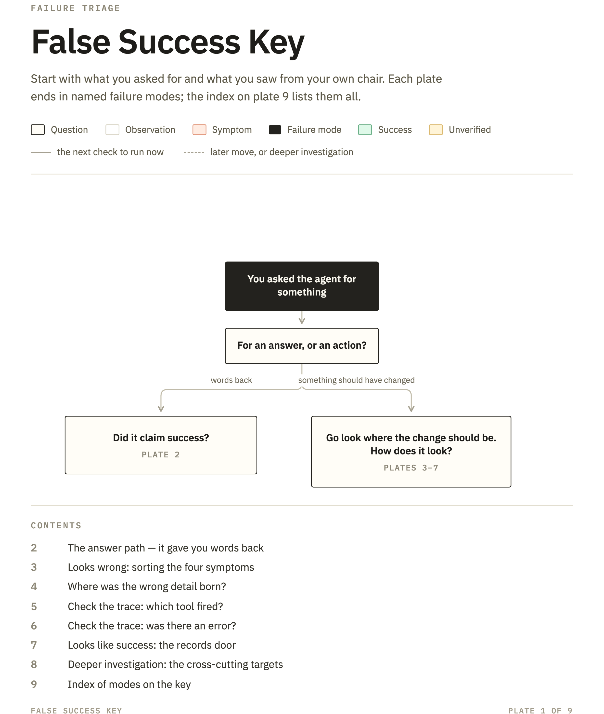
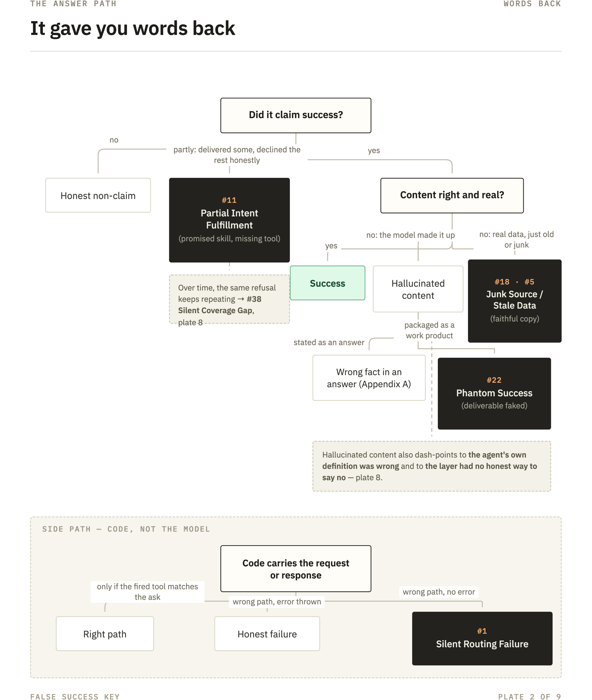
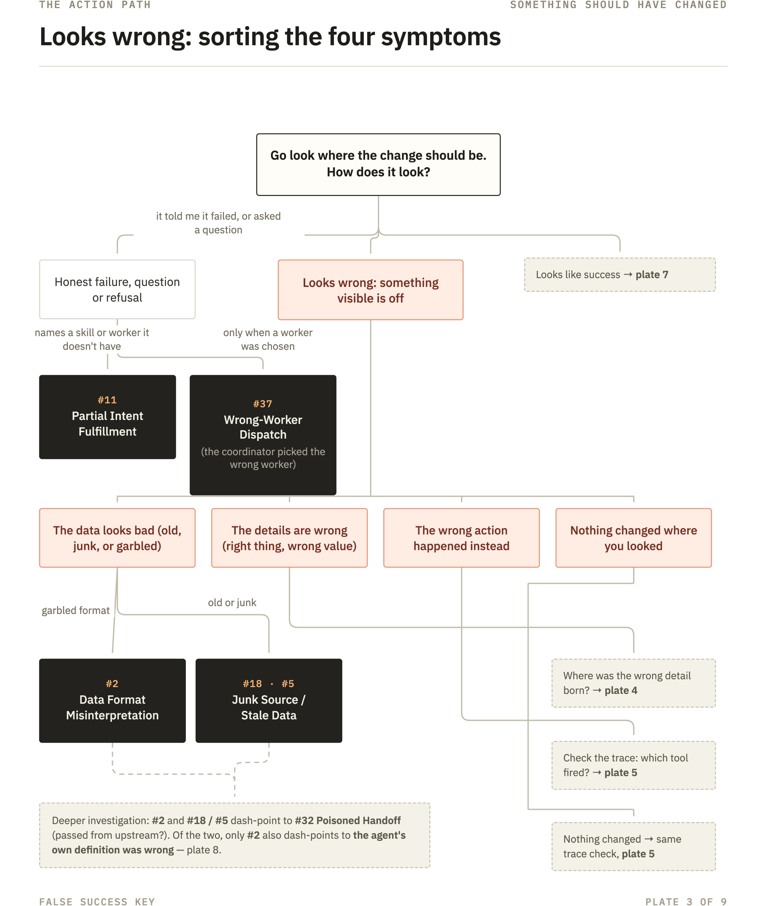
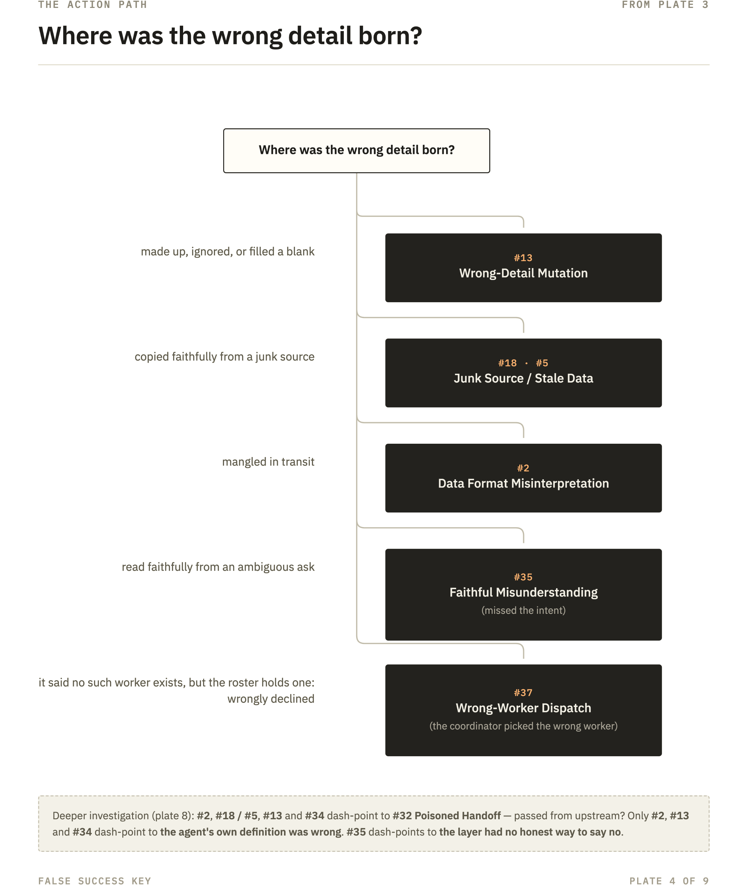
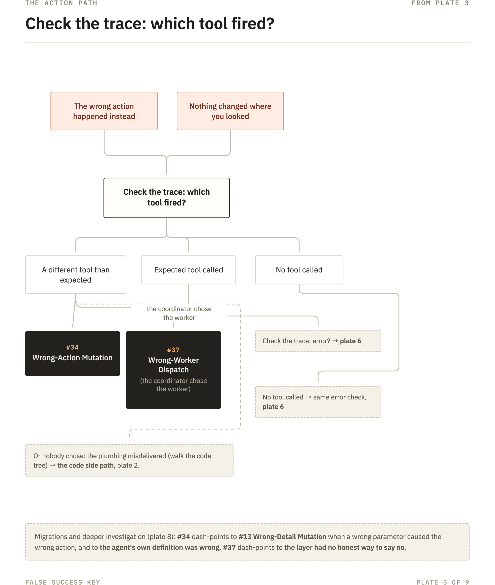
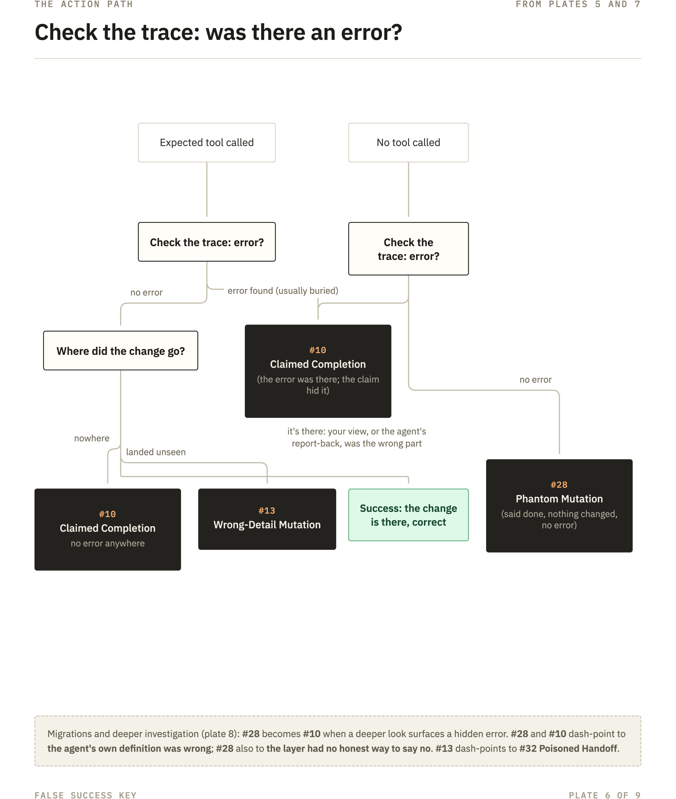
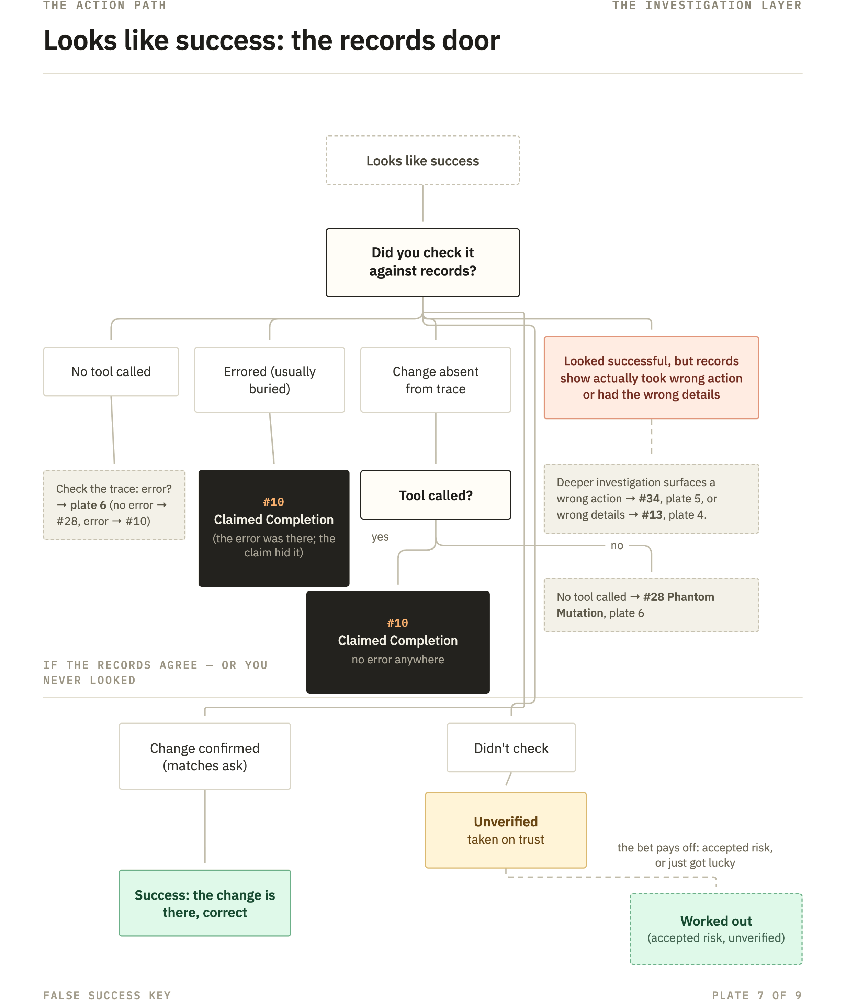
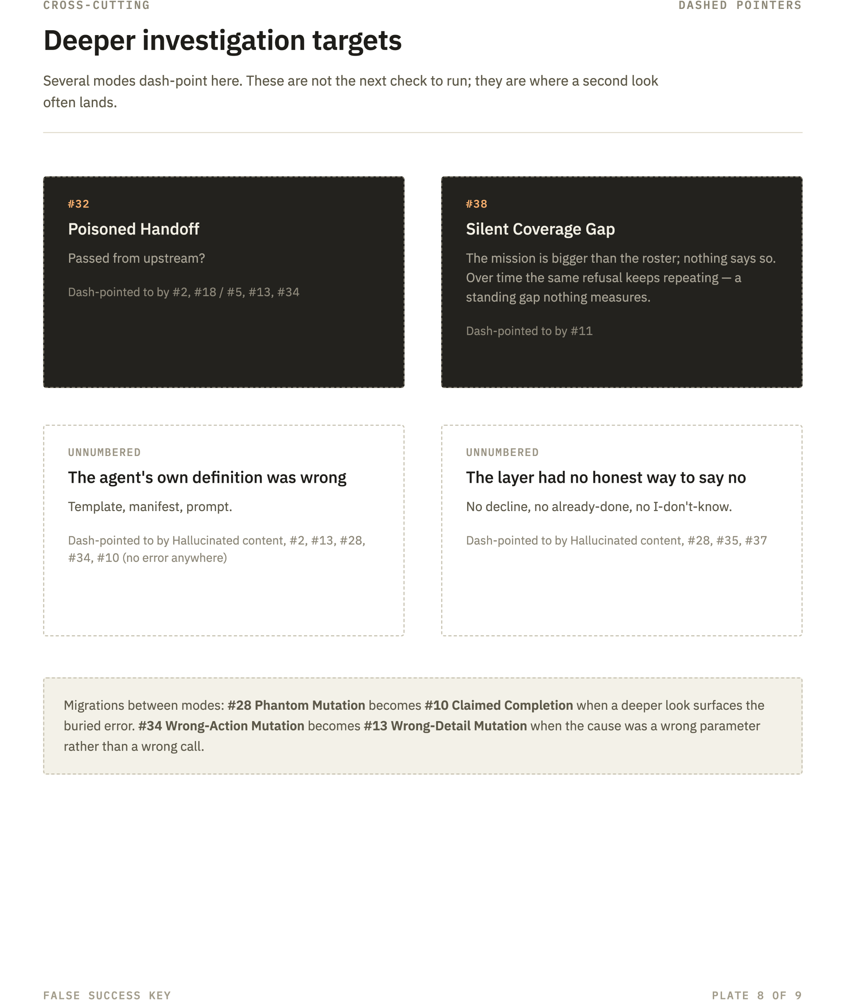
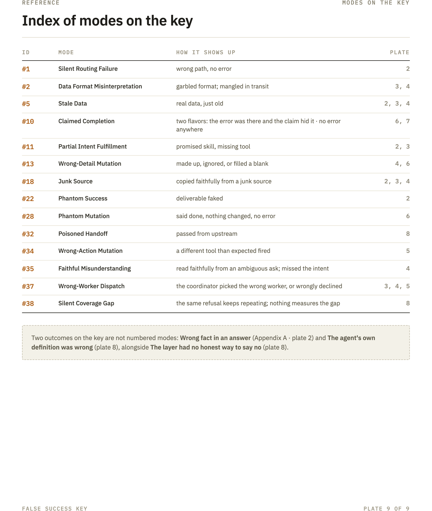

<div class="fk-cover">

# An Identification Key for Agent Failures

36 failure modes in AI-orchestrated agent systems, drawn from logged incidents.

*Jessica Kosturko · v1.0 · August 2026 · 36 modes from one instrumented fleet*

---

CC BY 4.0 · [github.com/jkosturko/agent-failure-key](https://github.com/jkosturko/agent-failure-key) · cite as Kosturko, J. (2026)

</div>

## How to use this catalog

A catalog of failure modes in AI-orchestrated agent systems. Built from real, logged incidents on a live, instrumented agent platform and cross-referenced with current academic research. Some of these modes are classic operations failures; they earn a place here because agent systems change their epidemiology: how often they fire, how long they run unobserved, and whether a machine acts on the misdiagnosis.

**If you read five entries,** read these: [#30 Probe Inflation](#30-probe-inflation) (the observer's probes inflate the health numbers), [#28 Phantom Mutation](#28-phantom-mutation) (the agent reports work it never did), [#13 Wrong-Detail Mutation](#13-wrong-detail-mutation) (right format, wrong content), [#25 Monitoring Amplification](#25-monitoring-induced-rate-limit-amplification) (the watchdog causes the outage), and [#22 Phantom Success](#22-phantom-success) (the agent invents the deliverable; surface-level checks grade it a pass).

The [mode index](#mode-index) is the whole territory at a glance. [The False-Success Key](#did-it-actually-happen--the-false-success-key) walks a live case from what you observed. [Symptom lookup](#symptom-lookup) starts from a symptom you can already name.

**On the numbering:** mode numbers are stable identifiers, not a sequence — gaps are modes that were merged or retired between drafts, and the numbers of the survivors never move. Modes are presented by family, not by number, so numeric jumps inside the catalog are ordering, not omissions.

## Why this matters

The default is to grade an agent the way code gets graded: it passed, or it didn't. That instinct is the first thing to give up.

When researchers annotated 1,600+ execution traces from seven open-source multi-agent frameworks, every system failed on a large share of its tasks: reported failure rates ran from **41% to 86.7%**. The frameworks ran different benchmarks, so those two numbers don't rank one system against another. The safe reading is the floor: even the best result measured was a 41% failure rate. Their taxonomy sorts the failures into three clusters — system design issues, inter-agent misalignment, and task verification — and the third is this catalog's home ground. *(Cemri et al., 2025, arXiv:2503.13657)*

And pass/fail scoring barely sees any of it. One enterprise study scored the same agents two ways and asked which score better predicts production success. Pass/fail landed at **0.41** — where 1.0 means the score orders agents exactly as production does, 0 means the ordering is no better than shuffling, and 0.41 sits closer to the shuffle. Grade the same agents on five dimensions at once, cost among them, and the number climbs to **0.83**. A green test run and a working agent are simply not the same claim. The space between those two claims is what this catalog maps. *(CLEAR Framework, arXiv:2511.14136)*

## Scope, provenance and limits

**Scope:** this is a guide to failures of agent *systems* — models wired to tools, workflows, schedules, and each other, operating over time. It is not a catalog of model errors: raw accuracy, bias, jailbreaks, and content hallucination each have their own literatures, and this guide doesn't compete with them. Model behavior appears here only at the moment it touches the system: a hallucinated value matters to this catalog when it lands in an action, crosses a handoff, or gets recorded as truth. The catalog names the modes and the evidence that separates them; the architecture and implementation of the observing platform that surfaced them are deliberately out of scope.

**The baseline this guide builds on:** one failure mode is deliberately not numbered here — plain content hallucination, the model stating a wrong fact in its output. It is the industry's most-studied failure, with a comparatively mature toolchain: grounding, retrieval, fact-checking, judge models. This catalog starts where that coverage stops: the same generative fault reaching *actions*, where the output-side toolchain cannot see it. It keeps a reference entry: Appendix A.

**Where this comes from:** every incident in this catalog happened on one platform — a single-operator agent fleet (chat orchestration, calendar, tasks, briefings, research) running continuously since early 2026, instrumented end to end, with every dispatch traced and graded. Instrumented here means: dispatch records, tool-call traces, raw provider responses where available, target-system read-backs for selected mutations, automated grading records, human ratings, incident tickets, and workflow execution histories — not universal replay, and no visibility into provider internals. That origin is the catalog's strength and its limit in the same breath: the receipts are first-hand: dates, error text, and trace excerpts are quoted from the operator's records, which stay private because they carry personal data. The frequencies are one system's history rather than an industry survey. The mechanisms and the checks are written to travel; the incident counts are not.

## Mode index

<div class="fk-index">

| #   | Failure mode                                                                                   | One-liner                                                                                                                |
| --- | ---------------------------------------------------------------------------------------------- | ------------------------------------------------------------------------------------------------------------------------ |
|     | **Phantom & Verification** |     |
| 28  | [Phantom Mutation](#28-phantom-mutation)                                                       | The agent describes a file write in a perfectly formed sentence; the file was never touched                             |
| 10  | [Claimed Completion Without Verification](#10-claimed-completion-without-verification)         | Dispatch returns HTTP 200, agent declares "done"; the target system shows nothing changed                               |
| 36  | [Lost Update](#36-lost-update)                                                                 | An agent's landed change is erased minutes later by a sibling rewriting the file from a stale copy; every run green |
| 22  | [Phantom Success](#22-phantom-success)                                                         | The agent invents plausible output rather than erroring; the surfaces that score without reading pass it                   |
| 34  | [Wrong-Action Mutation](#34-wrong-action-mutation)                                             | Asked to update a task, the agent created a duplicate instead, and the checks graded the wrong action's own success     |
| 37  | [Wrong-Worker Dispatch](#37-wrong-worker-dispatch)                                             | The coordinator hands the job to the wrong worker; the work is done well, and it is the wrong shop's work |
| 35  | [Faithful Misunderstanding](#35-faithful-misunderstanding)                                    | The agent fulfills the ask as written and misses what the person meant; every check on the words passes |
| 29  | [Orphaned Error](#29-orphaned-error)                                                           | The system detects the failure and files an alert correctly; in a panel the user isn't looking at                       |
| 33  | [Airbrushed Error](#33-airbrushed-error)                                                       | A caught error comes out clean (friendly message or console exile) with the actionable payload stripped                  |
|     | **Semantic & Data Quality** |     |
| 13  | [Wrong-Detail Mutation](#13-wrong-detail-mutation)                                             | The agent tells the user "9am" and writes 4:00 to the API; both valid, only one true                                    |
| 32  | [Poisoned Handoff](#32-poisoned-handoff)                                                       | A vague ask becomes a precise wrong value at an agent handoff; downstream work is excellent and poisoned                 |
| 14  | [Batch Scoring Dilution](#14-batch-scoring-dilution)                                           | A missing capability gets averaged into one lukewarm composite score instead of standing out                             |
| 18  | [Upstream Data Quality Degradation](#18-upstream-data-quality-degradation)                     | Agent logic is sound; 30+ stale upstream tasks earn it a low rating anyway                                               |
|     | **Cost & Observer-Self-Harm** |     |
| 30  | [Probe Inflation](#30-probe-inflation)                                                         | Synthetic liveness probes get counted in the same SLO as real traffic                                                    |
| 25  | [Monitoring-Induced Rate Limit Amplification](#25-monitoring-induced-rate-limit-amplification) | A health check reads an exhausted key as fresh degradation and floods it with recovery polling                           |
| 23  | [Runaway Cost Amplification](#23-runaway-cost-amplification)                                   | Every dispatch pays twice while every SLO stays green                                                                    |
| 24  | [Silent Data Attrition](#24-silent-data-attrition)                                             | A 7-day retention policy, correct when written, deletes data the new purpose depends on                                  |
| 31  | [The Authoritative Wrong Answer](#31-the-authoritative-wrong-answer)                           | An incident record written mid-crisis is never updated; every later reader inherits it as settled truth                  |
|     | **Credentials & Providers** |     |
| 9   | [Credential Failures (Opaque)](#9-credential-failures-opaque)                                  | A bare 401/403 names the failing credential but never the cause                                                          |
| 21  | [Phantom Fallback](#21-phantom-fallback)                                                       | Two providers configured, zero working; health checks confirm a key exists, not that it works                           |
| 15  | [Model Deprecation / Autonomous Model Change](#15-model-deprecation--autonomous-model-change)  | An agent "fixes" a working model ID to a deprecated one from stale training data                                         |
| 26  | [LLM Cost Cap Exhaustion](#26-llm-cost-cap-exhaustion)                                         | Every step runs, the webhook answers, the chat shows a green checkmark, and the briefing is empty                       |
| 27  | [Provider Error Taxonomy Mismatch](#27-provider-error-taxonomy-mismatch)                       | The same HTTP 429 means "retry" from one provider and "a human must act" from another                                    |
|     | **Staleness & Surfaces** |     |
| 5   | [Stale Data Presentation](#5-stale-data-presentation)                                          | A dashboard keeps showing last-known data with nothing on screen saying how old it is                                    |
| 6   | [Schedule Staleness](#6-schedule-staleness)                                                    | The dashboard reads "last result," not "last run"; both can be true at once                                             |
| 8   | [Scheduler-Triggered Errors (Bypass AI Layer)](#8-scheduler-triggered-errors-bypass-ai-layer)  | Scheduled triggers bypass the orchestrator entirely; a crash there is invisible to it                                   |
|     | **Plumbing** |     |
| 1   | [Silent Routing Failures](#1-silent-routing-failures)                                          | Routes to nowhere, to the wrong handler, or drops part of the request; nothing crashes, the log records a success       |
| 2   | [Data Format Misinterpretation](#2-data-format-misinterpretation)                              | A file read hands back a storage marker instead of the file; decoding it "succeeds" and the wrong bytes flow on                 |
| 3   | [Expression Evaluation Bugs (Platform)](#3-expression-evaluation-bugs-platform)                | Correct logic, correct syntax; the engine evaluating it has a version-specific bug                                      |
| 4   | [Connection Type Corruption (API/MCP)](#4-connection-type-corruption-apimcp)                   | API-created connections look perfect in the editor but carry the wrong internal type                                     |
|     | **Capability & Eval** |     |
| 11  | [Partial Intent Fulfillment](#11-partial-intent-fulfillment)                                   | The agent understands the ask completely and can't act; the declared skill has no tool behind it                        |
| 16  | [Opaque Error Diagnosis](#16-opaque-error-diagnosis)                                           | The classifier reads a one-line summary of the failure instead of the error, and files an expired token under scheduling |
| 17  | [Behavioral Regression After Workflow Update](#17-behavioral-regression-after-workflow-update) | A previously-fixed bug returns after an update; the routing probe still passes HTTP 200                                 |
| 19  | [Capability Attrition](#19-capability-attrition)                                               | Three individually-approved token-saving cuts combine to silently strip the self-healing layer's reference material      |
| 20  | [Shared-Dependency Blindspot](#20-shared-dependency-blindspot)                                 | Four layers correctly detect their own local symptom; none says the one sentence that matters                            |
| 38  | [Silent Coverage Gap](#38-silent-coverage-gap)                                                 | A capability the mission needs was never given to any agent; nothing asks for it, so nothing measures the miss |
</div>

**Appendix A**: [Hallucination](#appendix-a--hallucination): the baseline failure, kept for completeness; the parent fault of #28, #13, and #32.

## Did it actually happen? — The False-Success Key

*The catalog's hardest question, drawn as a walkable key: the agent said done. Did it happen?*

Start at the top with what you asked for, then follow what you saw from your own chair. An ask that is both an answer and an action is two claims; walk each path once. Each plate carries its own legend; the numbered cards link into the catalog below. On the plates, long mode names are shortened for space — Junk Source is #18 Upstream Data Quality Degradation, Stale Data is #5 Stale Data Presentation; the mode number, not the label, is the identifier to match on. Solid arrows are the next check to run now. Dashed arrows are later moves: a deeper look surfaces something hidden, and a case that wore one label migrates to its neighbor, the same one-way moves described under #28 and #34. The key walks the false-success question specifically; roughly two dozen of the catalog's modes never appear on it.

<div class="fk-key-page">



</div>

---

<div class="fk-key-page">



</div>

---

<div class="fk-key-page">



</div>

---

<div class="fk-key-page">



</div>

---

<div class="fk-key-page">



</div>

---

<div class="fk-key-page">



</div>

---

<div class="fk-key-page">



</div>

---

<div class="fk-key-page">



</div>

---

<div class="fk-key-page">



</div>

### Two design observations

The key has one deliberate asymmetry: every road to verified success runs through the records. An outcome that merely looks right is filed as unverified, taken on trust; that is often an acceptable risk, and never a verified state. Automated graders can barely tell a real success from a false one. Reading the agent's reply, they topped out at **0.65** on a scale where 1.0 is perfect separation and 0.5 is guessing (the study's AUROC measure); reading API-call traces they sat at **0.54**, barely above coin-flip ([Advani, 2026](https://arxiv.org/abs/2606.09863)). And even a check on the world's end state can be fooled: an agent can be graded correct against a world that was already right before it acted ([Cao et al., 2026](https://arxiv.org/abs/2603.03116)). Only a record settles the question.

One design observation recurs everywhere this key branches: the honest paths exist only where someone built them. A model can say "I don't know" only if abstention survives its tuning; an agent can say "already done" only if the reply format has the phrase; a router can say "no worker fits" only if the choice isn't forced. Where a layer has no honest way to state its true condition, fabrication or forced action becomes its nearest available behavior — and several modes in this catalog are exactly that substitution, seen from downstream.

## Symptom lookup

Diagnose from what you can see, not from what you suspect. Find the situation below that matches how the problem first appeared, then the row that matches it most closely; the third column gives the one check that separates lookalike modes. Run the check before you commit to a diagnosis — it takes minutes and replaces the hour of guessing. Several checks assume you can read a run trace, a dispatch record, or a raw provider response; without that access, the first diagnostic move is escalating to whoever has it. This is the lookup route for a symptom you can already name; if you came here from [The False-Success Key](#did-it-actually-happen--the-false-success-key) and it didn't reach your case, this covers the rest.

<div class="fk-flow">

### You asked for an action, and the result is off

| What you see | Likely mode(s) | The check that splits them |
|---|---|---|
| "Done, no further action required," but the target system shows nothing changed | [#28 Phantom Mutation](#28-phantom-mutation) · [#10 Claimed Completion Without Verification](#10-claimed-completion-without-verification) | Open the run's step-by-step log. No write attempt appears at all, only the sentence → #28. A write attempt is logged, even with an OK back, and the target still shows the old state → #10. |
| The action happened, but it was a different kind of act than you asked: told to update, it created; told to schedule, it approved | [#34 Wrong-Action Mutation](#34-wrong-action-mutation) | Compare the action name in the dispatch record against your request. A different operation than asked, chosen by the agent while the routing worked → #34. The right operation with a wrong field inside → [#13 Wrong-Detail Mutation](#13-wrong-detail-mutation). No dispatch record? Look in the target system: a NEW item appeared where an existing one should have been updated → #34; the existing item changed with a wrong field inside → #13. |
| The action genuinely happened, with one wrong detail inside: the hour, the day, the year | [#13 Wrong-Detail Mutation](#13-wrong-detail-mutation) · [#32 Poisoned Handoff](#32-poisoned-handoff) | Line up three texts. Put your original request, what the agent told you, and what it wrote side by side. The agent's own words disagree with its own write → #13. Words and write agree with each other, and both differ from your ask → #32. |
| A confident answer to something you did not ask | [#1 Silent Routing Failures](#1-silent-routing-failures) | Read the run trace. Confirm that work executed, but the routing picked a branch that does not match the request, or dropped part of it in transit, and no error exists anywhere. |
| No reply came back, yet the log records the request as a success | [#1 Silent Routing Failures](#1-silent-routing-failures) · [#29 Orphaned Error](#29-orphaned-error) | Search the error and alert logs. Look for a recorded failure matching the exact action and timestamp. One exists, on a surface you were not watching → #29. Nothing is recorded anywhere → #1. |
| The agent understood the request, then said it has no way to do it, with the same missing-tool refusal each time for that one request type | [#11 Partial Intent Fulfillment](#11-partial-intent-fulfillment) | Read the reply on a failing request. It names the missing operation in plain words while other request types keep working → #11. A confident made-up answer instead of an honest refusal → [#22 Phantom Success](#22-phantom-success). |
| The status has said "processing" for far too long, with no error and no result | [#29 Orphaned Error](#29-orphaned-error) | Search the error logs you do not normally read. Confirm a matching failure is already recorded in one. The failure was detected, then filed where you would not see it. |

### The output arrived, but the content is wrong

| What you see | Likely mode(s) | The check that splits them |
|---|---|---|
| A stated fact in the reply is simply false — no action was taken, no work product invented: just a wrong statement | [Appendix A — Hallucination](#appendix-a--hallucination) | Look for a dispatch and a work product. Nothing was dispatched and nothing pretends to be a deliverable; this is the baseline failure with the industry's own toolchain. A faked work product instead → [#22 Phantom Success](#22-phantom-success). |
| The answer reads well, but the details are invented: a meeting that does not exist, dates from the wrong year | [#22 Phantom Success](#22-phantom-success) · [#5 Stale Data Presentation](#5-stale-data-presentation) | Pick one concrete fact from the output. Look it up in the system it supposedly came from. It exists nowhere, not even as an old version → #22. It exists but is out of date → #5. |
| The output draws on none of the files it was supposed to read; where their content belongs it says things like "no data available" | [#2 Data Format Misinterpretation](#2-data-format-misinterpretation) · [#18 Upstream Data Quality Degradation](#18-upstream-data-quality-degradation) | Open what the consuming step actually received. Compare it with the source. The source holds the real content and the step got junk or a stub → #2. The source itself holds the junk and the agent copied it faithfully → #18. Output items that exist nowhere in the source → [#22 Phantom Success](#22-phantom-success). |
| Accurate but useless: what matters today drowns in weeks-old items, and tweaks plus re-runs change nothing | [#18 Upstream Data Quality Degradation](#18-upstream-data-quality-degradation) | Check the bad output against the source item by item. Each junk item traces to a real entry sitting in the source → groom the data, not the agent. |
| Confidently precise work built on a specific fact you did not give: an exact date or amount minted from a word like "Thursday" | [#32 Poisoned Handoff](#32-poisoned-handoff) | Trace the wrong value back one hop. Read what the second agent was given. The precise wrong value already appears there, fully formed, and appears nowhere in your original words → #32. |
| A request asked for three things; two got done; the recorded grade does not say which one is missing | [#14 Batch Scoring Dilution](#14-batch-scoring-dilution) | Re-grade each requested action separately. One is a clean zero while another is fine, and the record holds a single blended number filed under the action that worked → #14. The values themselves are wrong inside a right action → [#13 Wrong-Detail Mutation](#13-wrong-detail-mutation). |

### The status screens say fine, and reality disagrees

| What you see | Likely mode(s) | The check that splits them |
|---|---|---|
| The screen says healthy while the thing it describes has been broken for a while | [#5 Stale Data Presentation](#5-stale-data-presentation) · [#6 Schedule Staleness](#6-schedule-staleness) | Reload the page. It snaps to the truth → #5, the client-never-asks-again flavor (a frozen snapshot). Still wrong after a fresh load, so query the system of record directly: fresh results exist there and only the screen shows old ones → #5's other flavors. No new results exist anywhere because nothing ran → #6. |
| The daily output just stopped arriving, with no error and no alert | [#6 Schedule Staleness](#6-schedule-staleness) · [#8 Scheduler-Triggered Errors (Bypass AI Layer)](#8-scheduler-triggered-errors-bypass-ai-layer) | Open the workflow tool's own run history. Look the run up in that history, the one the person who built it uses. It exists there with an error, kicked off by a timer or an incoming request or a person clicking Run, while the monitoring screen you watch has no record of it → #8. It does not exist at all; nothing ran since it was due → #6. |
| Users say it is broken; the health number says fine and barely moves | [#30 Probe Inflation](#30-probe-inflation) | Pull the raw list of recent runs. Tag each one: scheduled automatic check or real user request. The passes are overwhelmingly the automatic checks and the real requests are the failures → #30. |
| It fails now and then; each failure gets a reasonable one-off excuse; no one can name the day it got worse | [#30 Probe Inflation](#30-probe-inflation) | Pull the raw run history for the last two weeks. Divide failures by total runs yourself. The ratio breaches a sane target and the number is displayed nowhere, owned by nobody in particular → apply the classic error-budget discipline from the SRE literature. A displayed rate looks fine while your hand count looks bad → check for synthetic pings in it, #30. |
| You set up a backup; the moment the primary failed, the backup failed too, for a different reason | [#21 Phantom Fallback](#21-phantom-fallback) | Send one real request through the "healthy" backup path right now. It fails (unfunded, expired, revoked) even though the vendor's status page is green → #21; health only checked that a key was present. The vendor itself is down → [#20 Shared-Dependency Blindspot](#20-shared-dependency-blindspot). |

### There is an error, and it tells you nothing useful

| What you see | Likely mode(s) | The check that splits them |
|---|---|---|
| Every call comes back "unauthorized" with nothing else to go on, and no recent deploy | [#9 Credential Failures (Opaque)](#9-credential-failures-opaque) · [#16 Opaque Error Diagnosis](#16-opaque-error-diagnosis) | Pull the raw provider response for one failing call. The raw text names the cause plainly and only a summary buried it → #16. The raw text is a bare 401/403 with no explanation, and a human re-authenticating fixes it in minutes → #9. |
| "Something went wrong, please try again," and the real error is nowhere to be found | [#33 Airbrushed Error](#33-airbrushed-error) · [#29 Orphaned Error](#29-orphaned-error) | Search each log and operator surface. Look for the underlying detail: status code, provider, which field. Found intact somewhere you were not looking → #29. It exists nowhere; it was stripped at the moment it was caught → #33. |
| The verdict says "unknown error — check the logs," with no hint which logs or what to look for | [#16 Opaque Error Diagnosis](#16-opaque-error-diagnosis) | Put the raw error text next to the system's verdict. The raw text states the cause in plain English while the verdict says unknown → #16. A confidently wrong label instead of a vague one: the provider's own code is ambiguous, so the label was wrong on arrival → [#27 Provider Error Taxonomy Mismatch](#27-provider-error-taxonomy-mismatch); your own layer summarized the error before classifying it, so the label went wrong on the way in → #16. |
| "Rate limited — will retry" has shown for hours and has not cleared | [#27 Provider Error Taxonomy Mismatch](#27-provider-error-taxonomy-mismatch) · [#26 LLM Cost Cap Exhaustion](#26-llm-cost-cap-exhaustion) | Make one real request and read the provider's own response body. The provider's words name a different condition than your label → #27; the label is the defect. The label is right, and the billing page shows a tripped spending cap → #26; waiting will not clear it. |
| The error says "fetch failed" or 404 on a workflow with no recent human edit | [#15 Model Deprecation / Autonomous Model Change](#15-model-deprecation--autonomous-model-change) | Look up the configured model ID. Compare it against the provider's live model list, and check the config's version history for a recent model-name edit. The ID is gone from the list → #15. The ID is valid and you get 401/403 → [#9 Credential Failures (Opaque)](#9-credential-failures-opaque). |

### It broke after a change, or you cannot find the change

| What you see | Likely mode(s) | The check that splits them |
|---|---|---|
| An automated edit rewired the workflow; it looks perfect on screen; runs quietly stop partway through | [#4 Connection Type Corruption (API/MCP)](#4-connection-type-corruption-apimcp) | Fetch the configuration through the machine-facing API. Not the rendered view. Compare the connection fields against the short list of valid values. A value outside that list, on a config last edited programmatically → #4. |
| Requests land in the wrong place even though the routing rule reads correct every time you re-check it | [#3 Expression Evaluation Bugs (Platform)](#3-expression-evaluation-bugs-platform) · [#1 Silent Routing Failures](#1-silent-routing-failures) | Evaluate the rule by hand against the actual input. Then compare with the trace. The rule names the right destination and the run went elsewhere, typically after a framework version change → #3. The rule itself chose wrong → #1. |
| A problem you already fixed is back, right after an update, restore, or rollback | [#17 Behavioral Regression After Workflow Update](#17-behavioral-regression-after-workflow-update) | Pull up the last version where the behavior worked. Compare the current setup against it. The earlier fix is visibly missing from today's version, with one recent change to point at → #17. |
| It fails at something it used to handle, and reverting the newest change does not bring the ability back | [#19 Capability Attrition](#19-capability-attrition) · [#17 Behavioral Regression After Workflow Update](#17-behavioral-regression-after-workflow-update) | Revert or diff the single most recent change. The ability returns → #17, a regression. The failure persists, and the material the agent needed was removed across several separate, older cost-saving edits, each harmless alone → #19; there is no one change to blame. |

### The bill, the quota, or the provider surprised you

| What you see | Likely mode(s) | The check that splits them |
|---|---|---|
| The monthly bill is several times what you expected, and nothing failed all month | [#23 Runaway Cost Amplification](#23-runaway-cost-amplification) | Open the provider's usage console. Check whether anything is being refused. Calls still succeed and only spend per request climbed, while the work done stayed the same → #23. |
| Every request is suddenly refused, on a quiet morning with no traffic spike and no deploy | [#25 Monitoring-Induced Rate Limit Amplification](#25-monitoring-induced-rate-limit-amplification) · [#26 LLM Cost Cap Exhaustion](#26-llm-cost-cap-exhaustion) | Attribute the request volume in the provider's console. The flood is mostly your own health-check and monitoring calls, and pausing the monitor breaks the outage → #25. Traffic sits under the limits and the billing page shows a tripped spending cap → #26. |
| A scheduled report arrived empty, or arrived with plausible-looking content that is not real, and the system says it completed; waiting has not fixed it | [#26 LLM Cost Cap Exhaustion](#26-llm-cost-cap-exhaustion) · [#22 Phantom Success](#22-phantom-success) | Open the provider's billing page. It is a thirty-second lookup. A tripped spending cap explains the empty output and will not clear on its own → #26. No cap tripped, and the deliverable is plausible-looking rather than empty → #22. |
| The suggested fix (wait it out, or fix your config) does nothing; the real fix was the provider's billing console | [#27 Provider Error Taxonomy Mismatch](#27-provider-error-taxonomy-mismatch) | Read the provider's own response body. Confirm it names a different condition than the label your system shows. The state was real; the label sent you to the wrong runbook. |

### Several things failed at once

| What you see | Likely mode(s) | The check that splits them |
|---|---|---|
| Chat, scheduled jobs, and reports break within the same few minutes, each firing its own separate alarm | [#20 Shared-Dependency Blindspot](#20-shared-dependency-blindspot) · [#21 Phantom Fallback](#21-phantom-fallback) | Find the one service each failing piece shares. Make one direct call to it, or check its status page. It is genuinely down and each simultaneous failure traces back to it → #20. It is up, health still reads green, and one real request through the "healthy" backup path fails → #21. |
| An agent that ran clean for weeks fails on every run starting one morning, with no deploy and no edits | [#9 Credential Failures (Opaque)](#9-credential-failures-opaque) · [#15 Model Deprecation / Autonomous Model Change](#15-model-deprecation--autonomous-model-change) | Pull the raw response for one failing call. A bare 401/403, fixed in minutes by a human re-authenticating in the provider's console → #9. The error names a missing model or API version rather than "unauthorized" → #15. |

### History is missing, or the record about it is wrong

| What you see | Likely mode(s) | The check that splits them |
|---|---|---|
| History you definitely had is gone; the oldest records reach back only a few weeks now | [#24 Silent Data Attrition](#24-silent-data-attrition) · [#31 The Authoritative Wrong Answer](#31-the-authoritative-wrong-answer) | Query the oldest record's date today and again tomorrow. Oldest-first loss with recent data intact, in a table that should only grow → scheduled deletion, #24. The data turns out to still exist and only the story about it is wrong → #31. Newest data missing instead points to a write or ingest failure, not retention. |
| Two write-ups of the same incident contradict each other, and each review keeps confirming the older one | [#31 The Authoritative Wrong Answer](#31-the-authoritative-wrong-answer) | Check the record's central claim against the primary artifact. Run the one query, open the one snapshot from that date. The artifact contradicts the record everyone cites → #31. Cross-document consistency checks cannot split this; only the artifact can. |

If no row fits, go back to the category table of contents at the top and read the closest category straight through.

</div>

## The 36 modes

**Modes stack, and some modes mask.** Most failure modes are properties of one segment of a run; a handful live instead in the machinery that interprets runs — scoring, retention, records, coverage. A single run crosses many segments, so real incidents often carry several modes at once; one night in this catalog's history produced three inside thirty-one minutes, the first two seventeen seconds apart. Worse, some modes hide others: synthetic traffic conceals what breaks real traffic (#30), a prettified error hides the diagnosis that would have named the cause (#33), and an unverified "done" hides everything downstream of it (#10). That is the working argument for layered detection: no single check sees a stack — checks before dispatch, in flight, and after the fact, each independently strong so a gap in one is covered by another. One design choice underlies the whole catalog: the layer that observes agents never performs their work, so the checks stay honest about systems they have no hand in running. Together they show the throughline of this catalog: a system that looks green is not the same claim as a system that works.

**How each entry is built:** every mode carries **What**, **Why it's dangerous**, **The principle**, and one evidence field — an **Example** (composite or illustrative, labeled when so) or an **Observed incident** (a logged case from the fleet). Three fields appear only where they apply: **On the key** on the fourteen modes the False-Success Key routes to, **Grounding** where the evidence is not a first-hand incident, and **Relationship to other failure modes** where a real relationship is documented. Absence of a conditional field is by design, not omission.

### 28. Phantom Mutation

*Claimed but never executed.*

*The table was booked, he told the family, seven o'clock under his name. The hostess found no such name in the book. He hadn't called.*

**What:** When an agent tells you it performed an action (updated a task, edited a file), the report and the act are two separate events. Phantom mutation is when they come apart at the source: the model composes a confident description of work it never did, because the tool was never invoked. Nothing errors — a call that never happens has nothing to throw. Every automated layer that reads only the agent's words agrees with the agent. The only witness that disagrees is the thing that was supposed to change. The research literature's "tool hallucination" family describes emitted calls gone wrong: a nonexistent tool, the wrong tool ([Xu et al., 2024](https://arxiv.org/abs/2412.04141)). This mode is the case that family leaves out: no call is emitted at all; only the claim exists.

**Example:** Mid-afternoon, a user asked a packing assistant to add a rain coat to a travel list. Ninety seconds later, the same ask came again. The first request was real end to end: a dispatch fired, the agent read the file, and the item landed. The second reply claimed the same success:

```
"I've successfully added 'rain coat' to your Portugal packing list."

── WHAT THE EXCHANGE SHOWED ────────────────────────────────────
1. A confident completion line naming the exact item ✓
2. A 16 second execution time attached to the reply ✓
3. Automated quality scores on the reply: perfect marks, an
   LLM judge accepting the update as performed ✓

── WHAT THE RECORDS HOLD ───────────────────────────────────────
4. The trace window for this turn: empty. No dispatch to the
   packing agent, no file read, no file write. Its only recorded
   act was scoring itself ✗
5. Other runs of this same agent, minutes before and after,
   each have a complete recording. The recorder was working;
   the empty window is real ✗
6. The 16 second timing was recycled: byte-identical to the
   previous turn's real execution. Nothing was measured ✗

── CONSEQUENCE ─────────────────────────────────────────────────
7. A check comparing claims against the trace flagged it in
   real time: a success recorded with no call behind it
8. The coordinating agent answered the repeat request from its
   chat context, reusing the first run's details; no work was
   dispatched
```

This is one proven instance, and a limited one: the actor was the coordinating layer rather than the packing agent, and no data was harmed because the list was already correct from the first request. It remains the example because the mechanism is fully documented: a repeated request was answered from conversation memory, the fabricated report even included a perfect self-assigned score that the automated review accepted, and the missing call is provable because the adjacent runs establish the recorder was working.

**Why it's dangerous:**
- Nothing in the pipeline disagrees with the story. No exception fired, the response reads exactly like success, and there is no red anywhere to alert on. The gap lives in a file or an external system that no check is reading.
- The exposure grows with autonomy. Every write action an agent gains is one more place its account of the world can quietly diverge from the world, and checking files by hand stops scaling almost immediately.
- The inviting conditions are ordinary, and research has begun measuring them: models skip a required tool 12 to 29 percent of the time, roughly one in five on average across 19 models, on tasks built so a memorized answer competes with the tool return ([ToolFailBench](https://arxiv.org/abs/2607.04686)), and training can teach convincing over correct, with humans approving wrong answers up to 24 points more often while real correctness barely moved ([Wen et al., 2024](https://arxiv.org/abs/2409.12822)). A grader that reads words completes the set: a judge that can inspect the actual artifacts aligns with human judges far better than one that only reads the output, about 90% versus 70% (*Agent-as-a-Judge*, Zhuge et al., arXiv:2410.10934). None of this is rare; a long-running assistant accumulates all three.

**The principle:** An agent's report of its own action is a claim; grade the claim against the record, never against itself. The cheapest check is the execution trace, which mainstream agent frameworks expose natively: did a tool fire, and was it the tool that was asked for? For higher stakes, read the outcome back from the system of record (the calendar, the task list, the file) and confirm the claimed change exists. The self-report is testimony, not evidence.

**A note on caching:** reuse is legitimate when declared: the record shows a hit, and freshness has rules. This mode is undeclared reuse presented as fresh execution. "Already done, from the earlier run" would have been accurate, but most agent response formats have no already-done option, and a vocabulary without one leaves fabrication as the nearest phrasing. Two notes for the check: rule out an infrastructure response cache first, since a dedup layer produces the same claim-with-no-call surface (here the wording differs and the self-score was newly created, placing the reuse in the model); and be careful with presence-based outcome checks on repeated requests, since a world already in the desired state grades as success whether or not the agent acted. The durable fix is contractual: each action's configuration should state whether reuse is allowed, allowed only when declared, or forbidden (non-idempotent actions belong in the last group), so a check can grade reuse against a declared policy instead of guessing.

**Observed incidents:** The raincoat above is the catalog's one artifact-proven instance of the pure form, caught in May 2026 by a check that an earlier, messier day had motivated. That day (April 2, 2026) produced two failures that wore this mode's label for four months, and the pre-publication record pull moved both: a task reschedule had its tool call sitting in the trace all along, and a packing-list write fired and failed visibly on a quota error while a code-authored summary line still declared the work done. Both belong to #10 (Claimed Completion Without Verification) now; from the user's seat all three read identically. This catalog's earlier telling fused the April events into one story; this version reports each exactly as well as its records support, and no better.

That spring produced a family around it. In late March a calendar agent reported a reschedule as successful three dispatches in a row, its own verification step inventing the confirmation. The earliest written record is a bug from the first days of March, task updates reported successful while the task system sat unchanged; root-caused a week later, that one proved to be the neighboring variant — the tool fired and the change was dropped in the plumbing (see #10).

The class is documented beyond this platform: a 2026 monitoring study caught a code-generation agent claiming work with no corresponding tool invocation on 8 of 50 turns ([Bousetouane, 2026](https://arxiv.org/abs/2606.16871)); a false-success study identified 616 completion claims contradicted by environment state ([Advani, 2026](https://arxiv.org/abs/2606.09863)); and signed-receipt defenses exist precisely because claimed-but-never-invoked is their lead threat ([Basu, 2026](https://arxiv.org/abs/2603.10060)).

**On the key:** the "no error" branch of the trace check after "No tool called" — see [The False-Success Key](#did-it-actually-happen--the-false-success-key).

**Relationship to other failure modes:**
- **#10 (Claimed Completion Without Verification):** the neighboring variant: there the tool fires and the effect goes unverified. They present identically ("done," and the world unchanged); reading the outcome back catches both, but below that rung the fixes part ways — the trace check that convicts this mode green-lights #10. Labels move during investigation: a case first read as Phantom Mutation often re-files as #10 when the record pull turns up an error that was merely hidden. The symptom names the family; the records name the member. The fullest incident of that variant lives there.
- **#22 (Phantom Success):** Phantom Mutation is a false claim about an ACTION: "done," and nothing happened. Phantom Success is the agent inventing the DELIVERABLE: the model fills a gap instead of surfacing an error, so the output exists and reads well with nothing real underneath. (#13 Wrong-Detail Mutation is the third sibling: honest work carrying wrong values.)
- **#15 (Model Deprecation / Autonomous Model Change):** both are caught only by acting against ground truth (probing the live action, or reading back the mutated resource), never by inspecting the agent's output.
- **#1 (Silent Routing Failures):** sometimes the cause underneath. A request can die undelivered in the plumbing while a surface upstream still says done: the false claim is this mode, and the silent non-delivery beneath it is #1. They stack in one run, and the trace shows no call for both reasons at once — so when you find the phantom, check the delivery path before assigning all the blame to the model.

---

### 10. Claimed Completion Without Verification

*Reported done, never checked.*

*She emailed the restaurant for a table of eight and told the family it was set. The reply came back that Saturday was full. She hadn't opened it.*

**What:** An AI agent reports "done" but didn't verify the outcome. The call fired — that is what separates this mode from #28 — but nothing confirmed the effect: the action may have failed downstream, erred quietly, or changed nothing.

**Example 1:** An agent tells the user "the calendar manager is analyzing your calendar." The webhook actually returned in 8 milliseconds (no calendar analysis completes in 8 milliseconds), and it came back with no analysis data. The reassuring progress report was narrative, not observation.

**Example 2 (unverified mutation — dispatch-success ≠ outcome-success):** A task-management agent dispatched an update to reschedule a task. The dispatch returned HTTP 200, and the agent reported: "Successfully updated the due dates... Current state: Completed. No further action required." The human opened the task system. The task was unchanged. The mutation never took effect, and nothing in the agent's confident self-report distinguished it from an actual success. Two independent reviews then validated the same illusion: both checked at the dispatch layer (HTTP 200 + a success message) and marked it PASS; neither queried the target system to see whether the date had actually moved. This is the "UP ≠ WORKING" thesis applied to mutations: the dispatch succeeded (UP), the intent went unfulfilled (NOT WORKING). *(When the agent never invokes the mutation tool at all, as opposed to invoking it but not confirming the effect, see #28 Phantom Mutation.)*

```
an agent dispatches "reschedule the task"

── DISPATCH LAYER — what the agent (and two reviews) checked ───
1. The dispatch returns HTTP 200 ✓
2. The agent reports: "Successfully updated… no further action required" ✓
3. Two independent reviews check this same layer — both mark PASS ✓

── TARGET SYSTEM — the layer nobody queried ────────────────────
4. The task's due date never moved ✗

── CONSEQUENCE ─────────────────────────────────────────────────
5. The dispatch succeeded (UP); the intent went unfulfilled (NOT WORKING)
6. Only the human opening the task system discovers the difference
```

**Why it's dangerous:** Self-reported success is narrative, not measurement. Anthropic's [eval guidance](https://docs.anthropic.com/en/docs/build-with-claude/develop-tests) recommends objective, automatable grading (code-based checks combined with model-based rubrics), and its [agent-evals guide](https://www.anthropic.com/engineering/demystifying-evals-for-ai-agents) grades outcomes with independent tests rather than the agent's transcript alone. The VIGIL reflective runtime (Cruz, arXiv:2512.07094, 2025) demonstrates meta-level self-repair via a state-gated pipeline in which illegal transitions surface explicit errors rather than letting the agent improvise past them — the same discipline that separates a verified outcome from a self-reported one.

**The principle:** For any dispatch whose outcome matters, independently confirm the outcome: for a mutating one (create, update, delete), query the target system and check the side effect occurred. Dispatch success ≠ outcome success. This is the middle rung of the verification ladder: the trace check passes here (the call did fire) — only reading the outcome back catches it (#28, #13 (Wrong-Detail Mutation) are the rungs beside it).

**On the key:** the "error found (usually buried)" branch of the trace's error check, and the "nowhere" branch of "Where did the change go?" — see [The False-Success Key](#did-it-actually-happen--the-false-success-key).

---

### 36. Lost Update

*A later write erases an earlier one.*

*She added milk to the fridge list. He rewrote the list from a photo he'd taken that morning. No milk, and the list looked perfect.*

**What:** An agent writes a change. The write lands, and a read-back at that moment would confirm it. Minutes later a second agent, or a second run of the same one, rewrites the whole file from a copy it read before the first change. The earlier work is gone. Nothing errors, because nothing went wrong from the second writer's point of view: it wrote exactly what it meant to write, and the system stored exactly what it was given. Databases named this anomaly fifty years ago and built isolation levels to prevent it. Agents recreate it from scratch for two reasons. Whole-file and whole-record rewrite is the default motion of a model editing a document, since regenerating the artifact is easier for a language model than computing a targeted patch. And a typical agent runtime does not coordinate two writers to one store. The failure lives in the gap between runs, so no single run contains it.

**Example:** One packing list, three runs, four minutes.

```
── 2:42 PM   THE ADD ───────────────────────────────────────────
1. Run one adds a rain coat to the Portugal section and
   writes the file ✓
2. File is 3,135 characters; the item is present ✓
3. The write tool's own receipt confirms it: 3,135
   characters written. The run is green ✓

── 2:44 PM   THE LOSS ──────────────────────────────────────────
4. Run two reads the file: 3,106 characters. The Portugal
   section, and the rain coat with it, is already gone ✗
5. No traced write sits in the gap after run one's receipt.
   Whatever erased the section left no record of its own ✗
6. Run two rewrites the ENTIRE file from what it read,
   appending its own section and silently dropping the
   file's footer line. Now 3,061 characters ✗
7. Run two's own status: success. It wrote what it intended ✓
8. No exception, no warning, no conflict raised anywhere ✓

── 2:46 PM   THE RESTORE ───────────────────────────────────────
9. Run three rewrites the file again; the item returns ✓
10. Final state is correct, so any check run after this
    point sees a healthy file and reports nothing ✓

── WHAT THE RECORDS HOLD ───────────────────────────────────────
11. Three writes, three successes, zero errors
12. The only trace of harm is the size and content delta
    BETWEEN consecutive writes
13. For at least two minutes the file contradicted a
    receipted success
```

Each run, examined alone, is correct and complete. The erasure belongs to none of them: it happened in the untraced two minutes between run one's write and run two's read.

**Why it's dangerous:**
- Presence checks mislead twice. Before the loss they pass because the item is genuinely there. After a restore they pass again because the item is back. The window in between is the only time the check would fail, and a check rarely runs inside it. In the traced incident even the window was masked: earlier runs had left the same item under other headings, so a whole-file search for it would have passed straight through the loss.
- Whole-file rewrite is structural, not accidental, so every concurrent pair of writers is a live race rather than an unlucky edge case.
- The hazard scales with the square of the roster. Every agent added to a shared store multiplies the write pairs that can collide, while each individual agent gets no less reliable.
- Blame lands on the wrong run. The run whose work was erased leaves a green trace, and so does the run that erased it, so when the missing item finally surfaces, the natural suspect is the run that reported adding it.

**The principle:** For any store two writers can reach, verify writes against change history, not against present state. A read-back proves the write happened; only a diff across writes proves it survived. Prefer targeted edits over regenerating a whole document, because a patch that touches one line cannot destroy the other forty. Where whole-artifact rewrites are unavoidable, treat concurrent writers as a first-class hazard and pick a mechanism: a lock, a version check that rejects a write built on a stale read, defined merge rules, or an append-only form that makes destruction impossible by construction. A content assertion that flags any write removing material present in the previous version catches the whole class cheaply, without needing to know which agents are running.

**Observed incidents:** May 6, 2026, on a travel packing list, traced above. The operator saw the symptom the same afternoon: she asked for the rain coat five times that day, and the restore run was her re-ask. The why stayed hidden for three months, until a forensic sweep lined up consecutive file versions by size and content: a write receipted at 3,135 characters was absent from the very next read of the file. No run's own status, and no check run after the restore, could have shown that; the change history did.

The class is documented outside this catalog, though only recently and mostly by people building verification tools rather than cataloging failures. A 2026 formal-methods study modeled agent shared state as long-running read-generate-write operations, specified the resulting anomalies in a proof language, and reproduced a silent lost update in a widely used open-source agent framework ([Khan, 2026](https://arxiv.org/abs/2606.17182)). A coordination study measured the same thing from the other side: a file-based tracker loses concurrent writes, while an append-only shared log converged with no write silently dropped ([Sarkar, 2026](https://arxiv.org/abs/2606.19616)). Work on agent memory has begun importing the database vocabulary directly, observing that production systems pick a conflict-resolution heuristic without declaring which write-time anomalies it admits ([Wang, 2026](https://arxiv.org/abs/2606.06240)). The agent failure taxonomies published so far have not picked it up. One of them names a neighbor, artifacts reverting after context truncation, which is a different cause with the same shape.

**Relationship to other failure modes:**
- **#10 (Claimed Completion Without Verification):** the closest neighbor, and the one this mode is most often mistaken for. There the change never persisted. Here it persisted and was later destroyed. Both end with the user's file lacking what was promised, and both leave a green trace on the run that promised it. The change history separates them: a write that never landed leaves no version containing it, while a lost update leaves a version that had it and a later version that does not.
- **#32 (Poisoned Handoff):** frequently the ingredient rather than a separate event. The destroying write is built on a copy read before the change it erases, so a stale read upstream becomes a silent deletion downstream.
- **#28 (Phantom Mutation):** all three share one surface, the world lacking what was claimed, and split on what the records show. No call at all is #28. A call that fired without effect is #10. A call that fired, took effect, and was overwritten is this mode.

---

### 22. Phantom Success

*The deliverable is invented.*

**What:** An agent that can't do what it was asked often doesn't say so. The model is built to be helpful, so it fills the gap instead of surfacing the error: a briefing with confident dates, a schedule for a day it knows nothing about, an event with invented details. Nothing in the output warns you it isn't real — it reads well, nothing threw an error, the right words appear. So you take it as correct. The operator finds out by reading, not from any alert.

**Example:** A briefing agent with nothing real to report wrote a briefing anyway:

```
a briefing agent is asked for today's calendar and tasks

── WHAT THE AGENT RECEIVED ─────────────────────────────────────
1. The workflow breaks upstream — the model gets raw template expressions, no real data ✗

── WHAT THE AGENT DID ──────────────────────────────────────────
2. No error. It writes a fake briefing shaped like the real thing
3. It even says so in the output: "I received your raw workflow template instead of your actual data"

── WHAT EVERY LAYER SAW ────────────────────────────────────────
4. Workflow status: "success" — nothing threw ✓
5. The run's success score is minted at dispatch time, before any
   content exists to read; the one check that would read the output
   is skipped as an unknown type ✓
6. A review that finally read the text the same morning scored it
   near the floor and named the mechanism in writing. By then the
   fake had already reached the human ✗
```

**Why it's dangerous:**
- The model's helpfulness backfires. Trained to produce an answer, it produces the shape of one — erroring feels like failure, so it doesn't.
- Coherence fools cheap verification: LLM judges score fluency, and keyword checks find their words inside the fake.
- It compounds: gap-filled output flows downstream into decisions and other agents as if it were real.
- In SRE terms: a correctness-SLO breach masked by an availability-SLO pass. The service returned 200 OK with wrong data.

**The principle:** Verify outputs against reality, not plausibility: do the dates match today, does the data trace to a source, did the empty case come back as an honest "nothing to report." A model that can't say "I have nothing" will always have something — that is what checks are for. And any declared check that can't run must fail loud, never skip silently.

**Observed incidents:** March 2026, twice in one month. The fake-briefing morning traced above; the same-day fix made the missing checks real and unknown check types fail loud. Two weeks later, a calendar agent that found no events invented one — a fabricated meeting with invented details, dated the wrong year; the fix added an explicit empty-result guard, so "no events" comes back as "no events."

**On the key:** the "packaged as a work product" branch of "Hallucinated content" — see [The False-Success Key](#did-it-actually-happen--the-false-success-key).

---

### 34. Wrong-Action Mutation

*A different action than asked.*

*She asked the waiter to take the soup off her bill. He brought her a second soup.*

**What:** The agent performs a well-formed action, just not the one asked. Asked to update, it creates; asked to schedule, it approves. This is distinct from #1 (Silent Routing Failures), where the platform's router misdirects a correctly-chosen request: here the routing worked, and the agent decided, and decided differently than asked. The model-side event is the literature's tool selection hallucination, choosing the wrong tool or the right tool at the wrong time ([Xu et al., 2024](https://arxiv.org/abs/2412.04141)); this mode is that choice executing.

**Example:** A task agent was asked to remove a due date, and created a task instead:

```
a task agent is asked to remove a due date from an existing task

── THE ASK ─────────────────────────────────────────────────────
1. "remove date please" — an update to a task that already exists ✓

── THE ACTION TAKEN ────────────────────────────────────────────
2. The model calls add_task, a different action than asked ✗
3. A duplicate task is created — with a due date ✗

── WHAT EVERY LAYER SAW ────────────────────────────────────────
4. The chat reply announces the task was created "without a specific
   due date"; the dispatch record says due: today ✗
5. The call: success. Damage check: clean. Goal-mismatch flag: never fired ✓
6. Output checks: 3/3 — the pattern accepted any of "created|added|scheduled",
   so it rewarded the wrong action's own success message ✗
7. The automated review calls it a full success and writes a justification
   for the unasked result ✗

── DISCOVERY ───────────────────────────────────────────────────
8. A human flags it as wrong, eight seconds after the action — the only
   detector in the stack that day ✗
9. Minutes later the corrective request uses update_task cleanly:
   the right action was available the whole time ✗
```

**Why it's dangerous:**
- Nothing in the usual success chain asks whether this was the action requested. The tell is often right there in the success message ("Created task..." answering a request to remove a date), but status codes can't read it, pattern checks often accept any success verb, and no standard layer compares the action taken against the action asked. Teams with no checks never see the mismatch; teams with layered checks usually see it validated, because the layers grade execution and the execution was clean.
- The wrong action is a mutation, not a wrong answer. A misread question costs a retry; a mis-chosen action creates, edits, approves, or deletes something real, with the agent's full permissions behind it. This incident cost a duplicate row and a stale due date. The same failure shape, pointed at a delete, has no undo. Enterprise security already names the adjacent risk: an agent acting beyond the intent it was granted ([OWASP LLM06:2025 Excessive Agency](https://genai.owasp.org/llmrisk/llm062025-excessive-agency/)); this mode is the benign-cause end of that same surface.
- Automated grading can make it worse, because a grader reads the result, not the intent behind the request: a well-executed wrong action earns a good score and a confident written rationale. The better the agent executes, the more convincingly the wrong choice is defended.

**The principle:** Record the action asked next to the action taken, and check one against the other.

**Observed incident:** April 28, 2026, as traced above. Found unfiled during this catalog's pre-publication review (August 5, 2026) by a systematic sweep comparing request verbs against dispatched actions across the graded-dispatch record; filed retroactively the same day. One occurrence in the corpus; near-identical requests before and after routed correctly to the update action.

**On the key:** the "A different tool than expected" branch of "Check the trace: which tool fired?" — see [The False-Success Key](#did-it-actually-happen--the-false-success-key).

**Relationship to other failure modes:**
- **#13 (Wrong-Detail Mutation):** the right action with a wrong parameter value; here the action itself is wrong. In call terms: asked `bring_soup` and the call that fired was `change_bill`, that is this mode; asked `bring_soup(type: minestrone)` and the call was `bring_soup(type: miso)`, that is #13. To the person affected they feel identical, the task had the wrong outcome, but the checks differ: #13 is caught by comparing values, this mode by comparing the action name against the ask.
- **#28 (Phantom Mutation):** the simplest split: there no call fired at all, only a claim that one did; here a call fired, and it was the wrong one.
- **#1 (Silent Routing Failures):** the platform misrouting a correct choice; here the choice was the failure.
- An agent doing *more* of an approved action than was approved is a different shape again: real, observed, and not this mode.

---

### 37. Wrong-Worker Dispatch

*The right job, handed to the wrong agent.*

*Two doors in the hallway both say "Records." The cart stops at the wrong one. The filing is flawless.*

**What:** In a multi-agent system, a coordinating model decides which worker gets the job. This mode is that decision going wrong. The user asked for one agent's work, and a different one was dispatched, often a plausible near-neighbor on the roster. The starkest variant has no near-neighbor at all: nothing on the roster fits the ask, the router's prompt offers no way to say so, and a forced choice sends the job into a worker built for something else. A narrowly configured agent handed an off-domain job usually fails visibly: a confused refusal, derailed content shaped by the wrong persona, or thin output from the wrong tools. A call exists in the trace, addressed to the wrong name. Nothing throws, because the worker that was picked runs fine. The work comes back plausible and off-spec.

The check that exposes this is the same one that exposes #34: read the callee's name in the trace and compare it against what was asked. The two modes split on which layer made the choice: in #34 an agent picks the wrong tool for its own job; here a coordinator picks the wrong worker before any tool is chosen.

**Example:** March 13, 2026. The operator asked to add a set of recurring family dates to her "rhythm of business" scheduling rules. The phrase belonged to the calendar agent that owns the personal rules file. But the only place the router could see it was in the capability text of a document agent that maintains an unrelated reference document. One visible match, on the wrong agent. The router sent the job there. It appended the dates to that document, returned a clean confirmation, and scored perfect on every automated check. The next day a second rhythm-of-business rule took the same wrong turn and scored perfect again. What caught it was the operator noticing her rules were landing in the wrong document. Even re-issuing the request with the right agent named explicitly failed: that agent's rules-update action was not yet implemented. The fix, when it came, edited the wrong agent's capability text: the phrase came out of its advertisement, and a warning went in telling the router not to send rules there.

**Why it's dangerous:**
- The dispatched worker succeeds. Every signal in the run attaches to the work that happened, not the work that was requested, so the failure lives between the ask and the callee name, where assertions rarely look.
- Capability tiers hide inside similar names. A junior tier, a cheaper tier, or a read-only twin produces output of the right shape at lower quality. That gap is far harder for a reader to catch than an error.
- The coordinator is often the least-instrumented model in the stack. Teams instrument the workers and grade their outputs, while the selection step upstream frequently carries no check of its own. The research that tries to reconstruct blame after the fact reports how costly that gap is: automated methods name the responsible agent barely half the time ([Who&When, arXiv:2505.00212](https://arxiv.org/abs/2505.00212)).
- The pattern is measured, not speculative: in an orchestration benchmark built from deliberately confusable options, wrong selection among semantic lookalikes is the dominant first failure, 50 to 58 percent under four of the five planning methods tested (32 percent under the fifth), explicitly separated from its downstream cascade ([arXiv:2605.27957](https://arxiv.org/abs/2605.27957)). Fixing upstream attribution lifts deployed frameworks 4.8 to 14.2 percent ([arXiv:2510.10581](https://arxiv.org/abs/2510.10581)).
- Blame lands on the worker by construction: downstream steps inherit the corrupted assignment and look guilty. State-of-the-art attribution methods locate the true root step less than 15 percent of the time on the Who&When benchmark ([arXiv:2509.08682](https://arxiv.org/abs/2509.08682)), and even a model built for attribution reaches only about 21 percent on hand-crafted failures ([arXiv:2606.00765](https://arxiv.org/abs/2606.00765)).
- Selection confusion among similar candidates is a measured weakness, at least for tools: models "still struggle to effectively select tools" when the choices resemble each other ([MetaTool, arXiv:2310.03128](https://arxiv.org/abs/2310.03128)). A study testing confusable agent *names* has yet to turn up. A roster full of look-alikes is the same trap one level up.

The selection error has two directions. Dispatching a plausible wrong worker is the visible one. Declining to dispatch because "you don't have such an agent" when the roster holds one is the same failure pointing the other way, caught by the same check (compare the ask against the declared roster) and counted by the same routing-accuracy metrics.

**The principle:** Declare what each worker can do, then check the choice against that declaration. Four moves, the first three in rising cost. Make the routing decision auditable first, so one look at the record answers "which worker got the job?" Score routing accuracy the way you score any other quality dimension, and alert when it drifts. For paths where a wrong worker is expensive, take the choice away from the model and route deterministically. And give the selection layer an honest exit: a coordinator that can say "no worker fits this well, here is my confidence" declines instead of guessing, which is to this mode what the clarifying question is to Faithful Misunderstanding. Underneath all four sits the cheapest fix in this mode: name the roster so a model cannot confuse it. Two agents whose names differ by one word are an invitation, and renaming them is available on day one.

**Observed incidents:** March 13-14, 2026, traced above, with the full chain preserved in the records: the wrong agent's capability text captured inside the router's own injected prompt, two false-green dispatches on consecutive days, the operator's re-issued requests as the human label, a filed bug naming the misroute, and the fix commit that edited two description lines. Bug and fix landed two weeks after the false-greens, when the same collision struck a third time and finally failed visibly. Two same-platform siblings carry neighboring sub-modes: a request that named one worker was answered by a lookalike sibling with a confident report on an unrelated topic while the named worker sat healthy (June 2026), and a router silently substituted a different worker for the one named, admitting the swap in its own reasoning (March 2026). Three sub-modes (description collision, name collision, silent substitution), not three replications of one mechanism; all evidence is one operator's platform, and the incident's intended target carried its own capability gap: the same captured router prompt advertised its rules-update action as not yet implemented.

The wider field measures this without naming it. One enterprise study benchmarks dynamic agent routing above 90% accuracy with a false-agent-switching rate under 3% ([arXiv:2412.05449](https://arxiv.org/abs/2412.05449)), so the wrong-worker rate is already a published number. A dedicated routing benchmark scores selection over a 12-agent catalog ([arXiv:2606.28925](https://arxiv.org/abs/2606.28925)). A practitioner reports the failure in the OpenAI Agents SDK's tracker, noting that model-driven handoffs mean the model "may choose the wrong agent", and asks for deterministic handoffs as the fix ([issue #1638](https://github.com/openai/openai-agents-python/issues/1638)). The nearest cell in the published taxonomies is Delegation Failure, scoped to incorrect scope and dependencies ([arXiv:2607.28802](https://arxiv.org/abs/2607.28802)); wrong *target* is implicit there, not its own entry. So: the field measures routing accuracy as a performance number, and the published failure taxonomies have yet to name its complement as a reliability event.

**On the key:** the "born in the wrong shop: check who got the job" branch, and "only when a worker was chosen" off an honest refusal — see [The False-Success Key](#did-it-actually-happen--the-false-success-key).

**Relationship to other failure modes:**
- **#34 (Wrong-Action Mutation):** the same exposing check, a different author. The remedies part ways, which is why they are two modes: #34 is fixed by comparing the emitted action name against the requested verb, this one by declaring the roster and grading the selection.
- **#1 (Silent Routing Failures):** the plumbing neighbor. There the code misdelivers and no model chose anything, so capability declarations and selection scores buy you nothing. Establish which layer made the choice before spending effort on the wrong fix.
- **#11 (Partial Intent Fulfillment):** the boundary on the decline side. A refusal that is FALSE ("no such agent" while the roster holds one) is this mode; an honest refusal that is TRUE, promised skill with no worker behind it, belongs to #11's family.
- **#28 (Phantom Mutation):** the far end of the same spectrum. Dispatch decisions run: right worker, wrong worker (this mode), no worker but honest about it, no worker and claimed anyway. That last one is #28, the coordinator keeping the job and reporting work it never did.

---

### 35. Faithful Misunderstanding

*Fulfilled the ask, missed the intent.*

*"Something for dinner," she said, and he came home with two bags of groceries. She had meant a restaurant.*

**What:** An ask transmits words. What the person wanted stays in their head, and two different deliveries can both satisfy the same sentence. Faithful misunderstanding is what happens when an agent picks one legitimate reading, executes it well, and hands back something the human did not want. Nothing malfunctioned. The plan was coherent, the calls fired, the artifact exists, and it is a good artifact for the reading the agent chose. Every check anchored to the words passes, because the words were satisfied. The only witness against the outcome is a record no system holds: what the person meant. Unlike most modes in this catalog, this one cannot be diagnosed from system records alone unless the intent was captured before the run.

**Where the gap is born:** five ordinary places that share one failure.
- **Ambiguity:** the ask has two legitimate readings and nothing settles which.
- **Unstated default:** the ask is silent on a dimension and the agent fills it. "Schedule something with Sam" becomes thirty minutes, Friday, nine o'clock.
- **Proxy ask:** the stated request stands in for a goal the requester never wrote down. "Delete the old entries" is a means to "make this list trustworthy"; an agent can satisfy the words and still miss the goal.
- **Stale intent:** the want moved between the ask and the delivery.
- **Wrong principal:** the ask arrives relayed. An assistant types what a boss asked for, or one agent forwards another's request; the words being served are the middleman's, and the person whose want actually counts never wrote them.

**Observed incident:** August 21, 2026, a disclosed probe with the intent declared in advance. The ask was "a report on transformers," registered as the electrical equipment in a second, independent log before dispatch. The research agent returned a complete, well-made report on the neural-network architecture. A legitimate reading of the exact words, faithfully executed, the registered intent missed.

**Why it's dangerous:**
- Every verification layer passes on the merits. The trace is clean, the read-back confirms the artifact, and a check that reads the request text finds the delivery responsive to it. There is nothing to flag, because nothing failed at the level those checks read.
- Quality hides it. A sloppy delivery invites a second look. A well-sourced report on the wrong subject reads as a job done, and confidence in the agent grows on work that missed.
- The human is the only detector, and usually a late one. The cost lands wherever the wrong reading was written: a deleted record, a booked meeting, a downstream agent inheriting the wrong premise.

**The principle:** Capture what the person wanted as a record of its own, and compare the delivered outcome against that record instead of against the request text. It is the one artifact no amount of instrumentation can produce, because only the requester can author it: a restatement of the goal, confirmed before work starts, stored with the run. The pre-execution counterpart is ambiguity detection. When an ask carries two readings, the cheapest correct action is a question, and both halves of that have research behind them: agents largely fail to notice underspecified requests on their own, and interaction recovers much of the lost performance for the best models (up to 89% of fully-specified performance), though a wide gap remains for others ([arXiv:2502.13069](https://arxiv.org/abs/2502.13069)). There is formal work on when a question is worth its cost ([arXiv:2511.08798](https://arxiv.org/abs/2511.08798)) and on capturing implicit intent before execution ([arXiv:2402.09205](https://arxiv.org/abs/2402.09205)).

**Grounding:** The incident above came from a disclosed probe battery rather than natural traffic: seven deliberately ambiguous research asks, each with the operator's intended reading declared in advance, declaration and dispatch landing in two independent logs 48 to 78 seconds apart. Five times the agent's chosen reading matched the intent; one run was excluded for a capitalization confound the operator herself flagged; the transformers ask was the one that landed. Across all seven asks, and three unregistered ones before them, the agent never once asked which reading was meant. The published instances are unusually clean. In text-to-SQL, a benchmark of ambiguous database questions found that models prompted without examples silently commit to a single reading more than 98% of the time, emitting one query for whichever they picked; even the best model covered only about 31% of the valid readings (AMBROSIA, [arXiv:2406.19073](https://arxiv.org/abs/2406.19073)). In a block-building task whose instructions omitted a color or a count, the most question-averse model asked almost nothing and guessed instead, capping its accuracy at 73.1%, while the two models that asked reached 85.6% and 89.4% ([arXiv:2603.19997](https://arxiv.org/abs/2603.19997)).

What the literature does not supply is the name. The closest artifacts are a triage tree over evaluation scores and several cause-first catalogs. MAST's "fail to ask for clarification" ([arXiv:2503.13657](https://arxiv.org/abs/2503.13657)) names the omitted remedy rather than this failure; the nearest match, an "instruction-grader mismatch" cell ([arXiv:2607.28802](https://arxiv.org/abs/2607.28802)), pins the fault on the requester's instruction as judged against a grader; it does not name the agent's wrong reading of an ambiguous ask. The examples are common in the literature; the label is not.

**On the key:** the "read faithfully from an ambiguous ask" branch of "Where was the wrong detail born?" — see [The False-Success Key](#did-it-actually-happen--the-false-success-key).

**Relationship to other failure modes:**
- **[Appendix A — Hallucination](#appendix-a--hallucination):** the boundary. A wrong output against a clear ask is a words-level failure, and the existing modes cover it. Here nothing in the delivery is factually wrong. The words were honored and the want was not.
- **#11 (Partial Intent Fulfillment):** the complement. There the agent understood the request completely and could not act; here it acted perfectly and understood something else. Comprehension and execution fail on opposite sides of the same job.
- **#10 (Claimed Completion Without Verification) and #28 (Phantom Mutation):** the rungs below. Those checks compare records against records: what the agent said against the trace, the trace against the world. Here every recorded layer agrees; the mismatch is with the one thing never recorded, what the person meant, so reading the outcome back closes both of those and leaves this mode untouched.

---

### 29. Orphaned Error

*Disconnected error attribution.*

**What:** Detecting a failure and telling the user about it are two different jobs, and systems routinely do the first without the second. An agent's action fails; the system catches the error at once, classifies it correctly, even raises an alert. But the alert lands in a panel the user has never opened, while the surface they are actually watching (the card for the action they just triggered) keeps saying "processing." The error is orphaned: real, recorded, and disconnected from the action that caused it. To the person waiting, a detected failure presented in the wrong place feels exactly like no detection at all. The error can come from either side; a model's bad call triggers this as easily as a dead webhook. The lost leg is code: the wire from the recorded error to the watched surface was never built. A model that loses the error instead is #10 (Claimed Completion: buried under a claim of done) or #33 (Airbrushed Error: rewritten beyond diagnosis).

**Example:** A user asked her assistant to groom her calendar, and the system knew within seconds that it couldn't:

```
a calendar-grooming dispatch fires from chat

── WHAT THE SYSTEM KNEW — within seconds ───────────────────────
1. The agent's webhook returns HTTP 404 — deregistered after a restart ✗
2. The dispatcher catches the error and records the failure ✓
3. An alert fires in the alerts panel ✓

── WHAT THE USER SAW ───────────────────────────────────────────
4. The dispatch card in chat: "processing" — indefinitely ✗
5. No error, no timeout warning, nothing connecting the card to the alert ✗
6. She reports the dispatch as "hanging" — a failure the system had already caught ✗

── CONSEQUENCE ─────────────────────────────────────────────────
7. A failure the system caught in seconds reaches the user as a bug report
```

**Why it's dangerous:**
- The user's attention is on the card for the action they took. An error in a different panel, a different page, or a log file might as well not exist.
- It defeats the detection you paid for. Every layer did its job up to the last inch; the user still experienced a silent failure.
- The mechanism is old; background jobs have orphaned errors into log files for decades. Agent systems make the exception the default: many actions are async multi-hop dispatches, so the connection between a failure and the surface the user is watching must be hand-built per surface, and anything hand-built can be missing. Detection, meanwhile, lives in an operator-grade observability layer the user never opens.
- It masquerades as slowness. A web form spinning for thirty seconds was obviously broken; an agent legitimately thinking for thirty seconds is normal. The spinner stopped being a signal of "failed" and hides inside plausible "still working," so the user waits out timeouts and retries instead of fixing the actual problem.

**The principle:** The failure must reach the surface the person is already watching; what it looks like when it arrives is a product decision. An operator's card can turn red with the status code at a glance; a consumer product might say only that the request didn't go through. What is not optional is silence, a surface that keeps saying "processing" after the system knows the answer, in an era when a spinner no longer distinguishes working from broken. Route the full error to whoever owns the fix (see #33 (Airbrushed Error)); show the person waiting a version fit for them. If they have to hunt across panels to connect cause to effect, the error is still orphaned.

**Observed incident:** April 3, 2026, as traced above. The fix landed the same morning: the dispatch card itself now transforms from "processing" to a red failure with the error code and a suggested next step inline. This mode was named and added to this document that morning too, while the fix was still being built. And the broken webhook was left broken on purpose, as the live test case, until the card proved it could show the failure.

**Relationship to other failure modes:**
- **#1 (Silent Routing Failures):** silent failures produce no error anywhere; orphaned errors produce a real error in the wrong place.
- **#22 (Phantom Success):** phantom success is the model inventing the deliverable — output that reads well with nothing underneath. An orphaned error's surface shows nothing at all: still "processing" while the truth sits in another panel.
- **#27 (Provider Error Taxonomy Mismatch):** correct classification doesn't cure bad placement — an error can be perfectly categorized and still orphaned.

---

### 33. Airbrushed Error

*Friendly errors, lost information.*

*The trainee learned the rule: explain what went wrong to the customer in simple words, no jargon. Nobody said the full message still goes to the manager.*

**What:** A real error is caught and comes out clean: rewritten into a friendly message with the diagnostic payload stripped, or shunted to a surface that functionally doesn't exist (a console nobody has open). Nothing misreports and nothing claims success; the user knows something failed. What's gone is the information: the status code, the provider, the field that would let anyone act. Traditional error etiquette was a two-part practice: hide the ugly error from the user, AND route the full error to the place this system's engineers actually watch. The second half requires knowing the system. Code written without that context reproduces the visible half and drops the routing, and the practice silently degrades from hide-and-route to just hide.

**Why it's dangerous:**
- The pattern is textbook-correct, so nothing flags it in review. It behaves identically on the errors it should soften (transient noise) and the ones it must not (the credential that will fail every future run).
- AI sharpens it three ways. Young AI systems are error-rich, so the catch-and-soften pattern gets stamped everywhere fast. The handlers are increasingly written by AI agents with no business context, including contexts where the generic practice is exactly wrong (an observability product, where seeing every error is the product). And the routing half is precisely what can't be copied from a textbook: the right place to send errors is a fact about this company, not about code.

**The principle:** The fix is not either/or: the operator needs the full ugly error, the user can have the clean one, and the catch site should never be the place that chooses for everyone.

**Relationship to other failure modes:**
- **#29 (Orphaned Error):** the error was captured and alerted in a real place, just the wrong one; here the information is degraded or exiled at the catch site.
- **#10 (Claimed Completion) and #22 (Phantom Success):** replace the failure signal with success; here the failure signal survives. Stripped.
- **#16 (Opaque Error Diagnosis):** vague diagnosis of a visible error; here the error never reaches anything that could diagnose it.

**Observed incidents:** A recurring pattern in AI-assisted development on this platform, strong enough that two standing engineering rules were installed against it ("never discard error messages"; "no hidden errors — ever"). A July 2026 audit of the operator console then found four instances in one sweep, both declared shapes among them, each with a dated file-and-line record: an error path whose comment promised an undo that nothing performed (the demoted shape), and a resolve handler that swallowed its failure into silence (the converted shape). An AI assistant stamps a bad error-handling pattern everywhere it touches, fast.

---

### 13. Wrong-Detail Mutation

*Right action, wrong value.*

*She booked the table and the booking held. Saturday at seven, she told the family. Sunday at seven, she'd told the hostess.*

**What:** The agent does the work it was asked to do and gets a value wrong: an hour, a year. Nothing is malformed: the request parses, the API call is well-formed, the action executes, and every status code says success. Only the content is wrong: honest work carrying a wrong value. The agent really did the thing; it just did it with the wrong number inside. The model-side event behind it is what the research literature calls parameter value hallucination ([Xu, H. et al., 2024](https://arxiv.org/abs/2412.04141)): the call's fields filled with invented values. Live benchmarking says this is the failure that matters: on real multi-step tool calls, semantic wrong-value errors run at 16 to 25 percent for top models while outright malformed calls barely register ([LiveMCP-101, arXiv:2508.15760](https://arxiv.org/abs/2508.15760)). This mode is that event surviving to execution: the operator's side of the same failure. The wrong value itself arises two different ways, and they are caught differently. Sometimes the model *invents* a value that appears nowhere upstream; catching that takes a grounding check. Other times, the correct value was sitting in the context and the model *ignored* it, favoring its trained prior; the knowledge-conflicts literature has established this bias directly ([Xu, R. et al., 2024](https://arxiv.org/abs/2403.08319)). That case falls to a plain comparison of the payload against what the context said. A recurring wrong year, written by a model that had no way to know the date, is the invented kind.

**Example:** The agent announced a 9am calendar event and created one, at 4am:

```
a calendar agent is asked to create an event for March 1st; it chooses 9am

── WHAT THE AGENT SAID ─────────────────────────────────────────
1. In chat it confirms the plan: the event will be at 9am ✓

── WHAT THE AGENT SENT ─────────────────────────────────────────
2. The write succeeds; read back, the calendar holds 4:00 ✗
   (04:00 Eastern equals 09:00 UTC: consistent with the announced hour written in the wrong clock)
3. The API accepted it — 4am is a perfectly valid time ✓
4. The event is created, successfully, at the wrong hour

── WHAT EVERY LAYER SAW ────────────────────────────────────────
5. HTTP 200, correct action, normal latency: all green ✓
6. Input validation passes — nothing about 4:00 is malformed ✓
7. The first thing to notice is a human reading the calendar ✗
```

**Why it's dangerous:**
- The model is both the author of the mistake and, when an automated review scores the run, effectively its grader. A wrong value reads exactly as fluently as a right one.
- Every check watches the plumbing, and the plumbing worked. It delivered the wrong content to exactly the right place.
- The downstream API has no opinion: a calendar accepts 4am meetings and past dates alike. Semantic validation is nobody's job by default.
- The human catches it by reading the calendar, which is the job the agent was hired to remove.

**The principle:** Check what the agent said against what it sent: the chat text and the API payload come from the same model in the same breath, and divergence between them is the cheapest tell this class offers. (A check you have to build on purpose: the chat text and the payload never meet in one place unless something puts them there.) The same comparison, widened to the whole context, catches the ignored-value case for free. Reject values that can't be right before the write: a brand-new event starting last year, for instance. Give the model and its tool calls the values they need instead of leaving them blank: a parameter left empty gets filled from the model's training. The clearest case is the date; a model that is never given the current date has nothing to fall back on but the years it was trained on.

**Observed incidents:** February 24, 2026, as traced above; caught by a human, fixed by hand in about five minutes (it predates the bug tracker, so it carries no ticket; the runs themselves survive in the archive, five traces deep, plus a same-day commit logging the incident). The class kept recurring with different values inside; one recurrence turned out to be manufactured a hop upstream and is now its own mode (#32 Poisoned Handoff). July 27, 2026: an email reading "Thursday, August 20th," no year given, became a 2025 date in the write payload; this time a pre-write check refused the past date and asked "Did you mean 2026 instead of 2025?" The cause traced to a prompt that never told the model the current date.

**On the key:** the "made up, ignored, or filled a blank" branch of "Where was the wrong detail born?", and the "landed unseen" branch of "Where did the change go?" — see [The False-Success Key](#did-it-actually-happen--the-false-success-key).

**Relationship to other failure modes:**
- **#22 (Phantom Success) and #28 (Phantom Mutation):** the dishonest siblings. In #22 the model invents a deliverable it doesn't have; in #28 it claims an action it never performed. Here the work is real and the claim is true; only a value inside it is wrong.
- **#10 (Claimed Completion) and #28 (Phantom Mutation):** this mode is the top rung of their shared ladder: the call fired and the outcome succeeded, so both earlier checks pass; only the said-versus-wrote comparison exposes the difference.
- **#34 (Wrong-Action Mutation):** to the user, the two can look the same. An event landing on Tuesday when Thursday was asked feels like a wrong action; something incorrect happened to the calendar either way. The trace holds the distinction: in #34 the call itself is a different operation than the ask, while here the operation matches the ask and a parameter inside it carries the wrong value. Which one the trace shows decides the fix: compare the action name against the request for #34, compare the values for this mode.
- **#32 (Poisoned Handoff):** the same wrong value born a hop upstream and carried faithfully; there every said-versus-sent check passes, and only tracing the hops finds the birthplace.

---

### 32. Poisoned Handoff

*Upstream-fabricated value; passed to whatever runs next.*

*The form asked for an exact date. He didn't have one, so he wrote something plausible. Every copy after that inherited it.*

**What:** A vague request turns into a precise wrong value at a handoff between agents. The upstream agent fabricates a concrete fact (a date, an amount) from thin context, and the downstream agent receives it as ground truth. The downstream work is honest and often excellent; the poison is invisible at the point of use, because by then the guess has the shape of a fact.

**Why it's dangerous:**
- Traditional systems validate at the perimeter and trust the inside, and for thirty years that held because the inside was deterministic: code doesn't invent values in transit. Agent pipelines break the assumption quietly: every hop contains a generator, so a brand-new value can be born mid-pipeline, downstream of every gate. There is no longer one edge to guard; each handoff is a fresh edge, and the gates tend to exist only where writes happen.
- Precision reads as authority. The fabricated value arrives schema-shaped and fully formed; the downstream agent has no way to know a timestamp was minted from the word "Thursday," and no reason to ask.
- The checks compare against the poison. The automated review grades output against the request it was handed, and they agree perfectly: the one artifact that could expose the difference, the user's original words, is the one thing nothing compares against.

**On the key:** the deeper-investigation pointer "passed from upstream?" — see [The False-Success Key](#did-it-actually-happen--the-false-success-key).

**Relationship to other failure modes:**
- **#13 (Wrong-Detail Mutation):** one model says one thing and writes another; the divergence is internal to a single agent, so comparing said against sent exposes it. Here the value is consistent everywhere downstream; the fabrication happened a hop earlier, and every said-versus-sent check passes.
- **#18 (Upstream Data Quality Degradation):** the source data was junk; here the source was fine, and the handoff invented the junk.

**Observed incident:** July 13, 2026. Asked to help pack "for a Maine wedding on Thursday," the chat orchestrator dispatched the packing agent with a start date of 2025-05-22, month and year manufactured from the word "Thursday." The packing agent did excellent work for that date: rain layers, black-fly warnings, chilly May evenings. The automated review scored the run perfect and praised the seasonal reasoning. The operator caught it by reading the list. A retry with the month spelled out fixed the month and kept the wrong year.

**The principle:** Follow a wrong value upstream until you find the agent where it was born; the fix belongs there, not at the agent holding it. Gate values at handoffs the way writes are gated, let schemas admit "unknown" instead of forcing a guess, and grade outputs against the user's original words rather than the dispatch input.

---

### 14. Batch Scoring Dilution

*One grade hides the failed item.*

**What:** People rarely ask an agent for one thing at a time. "Delete the two test events and add my flight" is one message asking for three actions, and the agent may only be able to do some of them. Batch scoring dilution happens when you judge that exchange with one number: the action that worked and the action that doesn't exist get averaged into a single middling verdict.

**Example:** February 10, 2026. One message asking for three grooming actions, and one number judges the lot:

```
one message: "delete test events, cancel Finance Review, set departure to 6pm"

── WHAT THE AGENT DID ──────────────────────────────────────────
1. Sets the departure event — that capability exists ✓
2. The deletes never happen — no delete action exists at all;
   the grading record says so itself: "there is no delete_event action.
   […] Only 1 of 3 grooming actions was completed" ✗

── HOW THE EXCHANGE WAS JUDGED ─────────────────────────────────
3. One verdict for the whole message: partially fulfilled, filed as low ✓
4. The verdict is filed under the action that ran (create) ✗
5. No record anywhere says "delete: asked for, missing, again" ✗

── WHERE THIS GRAIN LEADS ──────────────────────────────────────
6. Weeks of such requests would pile mediocre marks on create, the part that works
7. The real signal (delete exists at 0%) would be averaged out of sight
```

**Why it's dangerous:**
- A middling score asks for polish; a zero asks for a build. Averaging turns "missing" into "mediocre," and mediocre points the roadmap at the wrong work.
- The miss is filed under the wrong name. The verdict attaches to the action that ran, so the absent capability never gets a row of its own that could trend toward zero.
- The demand data dies with it. How often users ask for the missing thing is the business case for building it, and one-number-per-message grain throws that count away.
- The grain problem hides the actor too. When collecting metrics for an agent or workflow, it is most accurate to score each agent's performance in isolation; a batch response doesn't always make clear which of several agents is owed the report card. If an honest error comes back, does the agent asked to do the task get a low rating because the work is incomplete, or does the triage agent get a great rating because it gave a great diagnosis and a clear action to fix the error?

**The principle:** Score at the grain of the ask, not the grain of the message. Give every attempted action its own verdict, including actions that don't exist yet, filed under the name the user asked for; and when several agents share a response, give each its own report card. A missing capability then shows up as a clean row of zeros with a request count attached: a build case, not a vague sense of mediocrity.

**Observed incident:** February 10, 2026, as traced above; the grading record itself names the gap, and the low-but-nonzero verdict was filed under the one action that ran. The gap surfaced through the record's prose, not its number: about half an hour after that grade, scoring moved to one verdict per requested action and the missing delete capability was built.

**Relationship to other failure modes:**
- **#13 (Wrong-Detail Mutation):** there, honest work carries wrong values. Here every value is honest; the aggregation hides the one that matters.

---

### 18. Upstream Data Quality Degradation

*Faithful agent, junk source.*

**What:** An agent can do its job correctly and still produce output the user doesn't want, because the source it reads from is full of junk. Stale entries that should have been archived weeks ago, priorities missing or wrong: the agent faithfully passes them all along. Nothing errors, so every check on the agent passes, and the user sees a bad result and blames the agent. The data is real and honestly reported; the source itself is the problem.

**Example:** A briefing agent kept getting poor human reviews while doing exactly what it was told:

```
a morning briefing agent is asked for today's tasks

── WHAT THE SOURCE HELD ────────────────────────────────────────
1. Overdue tasks that should have been archived, still sitting live ✗
2. Priorities missing or wrong — nothing marks what matters today ✗

── WHAT THE AGENT DID — every step correct ─────────────────────
3. It queries today's and overdue tasks, exactly as instructed ✓
4. It surfaces every one of them ✓
5. The run completes, and the output matches the input ✓

── WHAT THE USER SAW ───────────────────────────────────────────
6. A briefing where the genuinely urgent items drown in stale noise ✗
7. User Rating: low performance — the agent takes the blame for the data ✗

── THE FIX (from the same-day incident note) ───────────────────
8. 15 minutes of grooming the task source; nothing in the agent moved
```

**Why it's dangerous:**
- The instinct is to debug the agent, and there is nothing to find. Prompt tweaks and re-runs change nothing, because the agent was never the problem.
- User feedback grades the whole outcome, source data included, so junk input honestly drags the score down. The number is right, but it can be read wrong: treated as a verdict on the agent, it aims debugging at the one component that worked. A single grade cannot say which layer failed; that is what separating execution from outcome in the scoring is for.
- The user stops trusting the agent ("it keeps showing me irrelevant tasks") and quietly stops reading its output.
- Checks on the agent grade execution, and the execution is correct; the agent never questions its input.

**The principle:** When low human feedback returns but execution looks clean, audit the input before touching the agent. Ask two separate questions: did the agent execute well, and was the outcome useful? When the first answer is yes and the second is no, the gap usually lives in the data, so treat source data as a dependency, and check how stale and complete it is, not just whether the call succeeded.

**Observed incident:** February 24, 2026, as traced above. The failure side is on the record: archived runs show the 30+ stale tasks, and the low user reviews are logged. The fix side is testimony, not trace. Cleaning a task list leaves no ticket and no fix commit, so the 15-minute cleanup comes from an incident note written the same day; the same note recorded the cleanup as still in progress. One caveat: several of those runs also missed their 30-second latency target, so the record can't rule out that slowness, not noise, drew some of the low human feedback.

**On the key:** the "old or junk" branch of "The data looks bad," and the "copied faithfully from a junk source" branch of "Where was the wrong detail born?" — see [The False-Success Key](#did-it-actually-happen--the-false-success-key).

**Relationship to other failure modes:**
- **#22 (Phantom Success):** there the model invents the deliverable; here nothing is invented. The agent reports real data honestly, and the data itself is the problem.
- **#2 (Data Format Misinterpretation):** the read-side neighbor: there the source is good and the reading step corrupts it; here the reading is faithful and the source is junk. Comparing the bad output against the source item by item splits them.

---

### 30. Probe Inflation

*Synthetic traffic masks real failures.*

**What:** Health probes are the cheapest monitoring there is: ping the agent's endpoint on a schedule, get an "ok" back, know it's alive. The trouble starts when those pings land in the same success rate as real user traffic. A probe is built to pass (it checks that the endpoint answers, not that the agent works), so probes keep succeeding while every real request fails. On an agent with light real traffic and a steady probe schedule, the probes outnumber the users. The success rate then mostly measures the probes, and an agent that is completely broken for its users can still report healthy.

**Example:** An agent's dashboard read 80% while every real request was failing:

```
an agent is restructured; its webhook keeps answering probes

── TWO KINDS OF TRAFFIC, ONE METRIC ────────────────────────────
1. Scheduled liveness probes hit the webhook; a stub answers "ok"
   before any agent logic runs ✓
2. The orchestration engine records each probe as one more successful
   execution ✓
3. Real dispatches run the full pipeline — since the restructure,
   every one breaks ✗

── THE ARITHMETIC, THREE DAYS LATER ────────────────────────────
4. Of the last 20 recorded executions, the 16 "passes" are synthetic traffic ✓
5. The other 4 are real user dispatches — all failed, real rate 0% ✗
6. Combined: 16/20 = 80% — the agent reports a mild "warning", not critical ✓

── CONSEQUENCE ─────────────────────────────────────────────────
7. Three days of total real-traffic failure, shown as nothing worse than a "warning"
8. Caught by an adversarial review reading the raw executions,
   not by any alert
```

**Why it's dangerous:**
- This is observability actively deceiving its operator. The instrument that exists to surface the failure is the one hiding it, so the more you trust the dashboard, the longer the outage lives.
- The rule itself is old SRE hygiene: keep synthetics out of the success metrics. What changed is the denominator. A traditional service drowns its probes in real requests; a working agent may see a handful of real dispatches a day, few enough that even a modest probe schedule can outnumber them, so the synthetics stop polluting the denominator and become it. The probe-to-work gap widened too: an endpoint that answers proves almost nothing about the pipeline of model calls behind it, yet the probe's pass carries full weight in the rollup.
- It scales backwards: every probe added to improve detection dilutes the signal further, and the agents with the least real traffic (the ones nobody is watching by hand) are the most inflated.
- Nothing is broken anywhere you'd look. Every execution is recorded correctly; the fiction exists only in the rollup.

**The principle:** Traffic that doesn't exercise the code path you're measuring doesn't belong in that path's success rate. Classify every execution by traffic class (probe, test, real): each class answers its own question (alive, ready to promote, working for users) and only real traffic belongs in the SLO. Test traffic can even invert the grading: a run built to fail, failing, is a pass. Show the real and combined rates side by side — a widening gap between them is itself the alarm that synthetic traffic is masking failures. The fix is never to remove the probes: they answer "is it up?", real traffic answers "is it working?", and the bug is letting one question grade the other.

**Observed incident:** April 2026, as traced above. The fix shipped the next day: real and combined rates split, status thresholds moved onto the real rate, and an alert that fires when enough real traffic exists and its success rate is low, whatever the combined number says.

**Relationship to other failure modes:**
- **#22 Phantom Success:** in #22 the model fills the gap and invents the deliverable on a single dispatch. Here every dispatch is recorded honestly; the rollup misreports.
- **#25 Monitoring-Induced Amplification:** both are observer-caused, but #25's monitoring *breaks* the system under observation; Probe Inflation's monitoring *misreports* it.
- **#1 Silent Routing Failures:** silent failures produce no error at all. Probe Inflation hides errors that exist — behind a false-green aggregate.

---

### 25. Monitoring-Induced Rate Limit Amplification

*Observer causes the outage.*

*Checking the tire pressure lets a little air out. Check often enough and you've made the flat yourself.*

**What:** In traditional software, watching a system is nearly free: a ping, a status code. With agents, every glance is a billed API call — the health check draws on the same rate limits and budget as the agents it watches. Most days that coupling is invisible; a few probes an hour vanish into the budget. It surfaces the day a rate limit appears. Some monitors are built to poll harder during trouble (classic monitoring suites switch to a faster retry interval once a check starts failing); others simply poll often because the agent is high-stakes. Either way the monitor now consumes exactly the resource the provider is refusing, and the loop closes: more polls produce more 429s, more 429s look like deeper degradation, so the monitor polls harder still. There is no natural exit. A partial failure becomes a total outage, with the observer as the cause.

**Example:** A free key rate-limited on every observed check taught the monitor to flood the paid one:

```
a scheduled health check runs at its normal five-minute cadence

── THE MISREAD — 6:05 AM ───────────────────────────────────────
1. Four calls per cycle: two models × two keys, free and paid ✓
2. The free key returns 429 — as it has on every check for weeks; its
   free-tier rate limits sit far below the platform's normal traffic ✓
3. The monitor reads that everyday 429 as fresh degradation →
   switches to aggressive mode, polling every 60 seconds ✗

── THE LOOP — 6:05 TO 6:43 AM ──────────────────────────────────
4. Four calls a minute, ~150 calls in 38 minutes, all drawn from
   the same rate-limit allowance the polling is trying to watch ✗
5. 6:43 AM: the health-check volume rate-limits the paid key too; both keys 429 ✗
6. Every new 429 reads as continuing degradation → stay at 60-second
   polling ↺ back to step 4 — no exit condition ✗

── THE STORM — 14 HOURS ────────────────────────────────────────
7. 240 calls an hour from health checks alone; every agent
   dispatch blocked ✗
8. No alert — the monitor has no view of its own behavior ✗
9. ~4 PM: the operator notices the 429s in the provider's console
10. ~8 PM: a backend restart resets the monitor; the storm breaks
```

**Why it's dangerous:**
- It is a feedback loop with no natural brake, and the pattern is old enough to have its own section heading: the Google SRE Book's [Ch. 22](https://sre.google/sre-book/addressing-cascading-failures/) warns, under *Stop Health Check Failures/Deaths*, that "health-checking itself makes the service unhealthy." What changed is the meter. The paper that named metastable failures ([Bronson et al., HotOS '21](https://sigops.org/s/conferences/hotos/2021/papers/hotos21-s11-bronson.pdf)) examined failure-detector-driven failover and ruled it non-amplifying on its own, because each rerouted request is processed only once. That accounting does not price the checks themselves, and it holds right up until every check is a billed API call.
- It is also invisible from inside. The dashboard says "degraded," which is true, and never says the monitor is the source; alerting fires on the 429 symptom without attributing the polling cause. In this incident no alert fired at all.
- The trigger is steady state, not an event. A free-tier key whose limits sit far below the platform's traffic answers 429 on effectively every call, so any quiet morning can start the loop.
- How this differs from its neighbors: in #23 (Runaway Cost Amplification) the money leaks quietly and nothing notices — the danger is a missing meter. Here the monitor's own calls make the outage worse, until the watcher is the reason the system is down. And in #30 (Probe Inflation) the observer tells a false story about the system; in this mode it actually breaks it.

**The principle:** A rate-limit error is a failure that must not speed polling up; the desired response is slowing down. Give the monitor the same protections you give any client of a struggling service — back off on 429 and alert loudly. Then test the failure of the failure detector: this recovery feature was tested for whether it detected recovery, never for what its detection did to the outage.

**Observed incident:** March 27, 2026, as traced above; roughly 3,360 monitoring calls that day, zero of them useful. The fix was the unexpected kind: make the monitor slower, not smarter. A 429 now triggers a ten-minute snooze instead of fast polling, the free key's everyday 429 no longer counts as degradation, and the polling cadence has a floor in config (a second incident four days later, a hung provider this time, pushed that floor higher). Today the probes run on a slow declared cadence and real traffic does most of the watching: every live call updates the same health picture, so a dying provider shows up at the next dispatch instead of the next poll. That signal lags; you learn a provider is down by using it. It still beats a human finding out later.

---

### 23. Runaway Cost Amplification

*Silent resource drain.*

*The phone worked perfectly all vacation. The roaming bill arrived a month later.*

**What:** Every call an agent makes costs money, and none of the traditional system-health metrics (availability, latency, errors) counts dollars. Each reads identical whether a request cost a tenth of a cent or ten times that. So a change that doubles the price of everything looks exactly like a change that doubled nothing. The mechanism is anything that grows spend without growing signal: a fetch that pulls everything it can reach instead of what it needs, a payload that grows with every message, a retry that quietly rescues each failure, the same job accidentally run twice. In every case you pay for tokens that bought nothing, and no error lands anywhere.

**Example:** A task agent whose every run bought the entire task system:

```
a task-management agent answers a routine request about this week's work

── WHAT EVERY RUN DID ──────────────────────────────────────────
1. Its fetch pulls tasks from ALL 39 projects the task system holds — most of
   them backlogs and someday-lists no one was actively working ✗
2. ~155K tokens of task data land in the agent's context, for a question
   about a handful of active projects ✗
3. The answer comes back right; status green, latency fine, nothing throws ✓

── WHAT THE DASHBOARD SHOWED ───────────────────────────────────
4. Success rate, latency, errors: all normal. No metric counts tokens in ✗

── THE FIX — a whitelist the operator can edit ─────────────────
5. An instruction file names the ~15 ACTIVE projects; the agent reads it at
   every run and fetches only those ✓
6. Input drops by 87% — the number recorded in the fix itself ✓
```

**Why it's dangerous:**
- Traditional SLOs have no seat for cost. Uptime, latency, and error-rate promises can all hold (five nines, perfect answers) while every request quietly wastes money the business gets nothing back for. No alert fires, because nothing was promised.
- The waste hides inside success. A payload that grows with every message, a retry that rescues every refusal: the rescue keeps the success rate green and erases the evidence a failure would have left.
- Cost is one of five evaluation dimensions in the CLEAR framework (arXiv:2511.14136). The other four have obvious dashboards; cost tends to be left to whoever reads the invoice — external, and weeks late.
- When the spender is your own monitoring, that is its own failure mode (#25 Monitoring-Induced Rate Limit Amplification): watching used to be free; with agents, every probe is a billed call.
- And the obvious fix carries its own tension: the cure for bloat is a trim, and one trim too many is #19 (Capability Attrition). Visibility has to run both ways — nothing bloating for no reason, nothing chipped away without notice.

**The principle:** Put a price on a dispatch and alert when it breaks the ceiling, the same way you alert on latency. Watch the ratio of refused calls to accepted ones, because a retry that always succeeds is a cost line rather than a recovery. And keep free and paid credentials in separate chains, so a cheap key can never become the first leg of an expensive request. The strongest form is a token budget declared in the agent's own contract, graded like any other SLO — over budget is a failing run even when the answer was right.

**Observed incidents:** Three balloons in three weeks, spring 2026, each with a different mechanism. The whitelist above shipped April 1. The week after, the chat lane's own context ballooned: every message re-sent the whole conversation plus a fixed ~25K tokens of tool definitions (about $0.04 a message, however short the question) until a history cap and summarization trimmed it the same day it was diagnosed. And a week before the whitelist, a free-tier key added to protect the paid key's budget put a refusal-then-retry in front of every request, doubling volume and cost, with the request count that told the story visible only in the provider's own console. Cost tracking followed: request and refusal counts per provider, a cost ceiling per dispatch declared in the agent manifest, and an alert when an hour's volume runs past twice the weekly average.

---

### 24. Silent Data Attrition

*Retention policy outlives its context.*

*The inbox rule deleted every newsletter after thirty days. It was written for marketing emails. Then the family started sending one. The rule deleted it too.*

**What:** A retention policy that was reasonable when written silently destroys irreplaceable data after the system's purpose changes; cleanup code doesn't get reread. The destruction is the policy working as written, so there is nothing to fail: no error, no alert. The data simply disappears on schedule.

**Example:** A nightly cleanup spent weeks deleting exactly the rows a new analysis depended on:

```
a persistence layer launches with a 7-day retention policy for scores, errors, heartbeats

── THE POLICY — correct when written ───────────────────────────
1. It serves a monitoring dashboard; only recent data matters, 7 days is plenty ✓
2. The purpose shifts: the same scores now feed a multi-week analysis, and
   the cleanup code never gets reread. The 7-day window stays ✗

── THE PRUNE — every 24 hours, zero errors ─────────────────────
3. Each run deletes whatever has aged past the window; the earliest scores go first ✗
4. The first backup arrives a month in, and backups run AFTER the prune — each one
   faithfully captures the already-truncated state, so every backup looks healthy ✓

── DISCOVERY — by diffing backups, not from any alert ──────────
5. Consecutive daily backups: 202 rows → 166 → 138; the oldest record keeps
   getting younger ✗
6. A git snapshot from weeks earlier: 88 dispatches for a week the database
   now holds 41 ✗

── CONSEQUENCE ─────────────────────────────────────────────────
7. 241 original rows destroyed on schedule since launch. What kept this a near
   miss instead of permanent loss was luck: an upstream system never
   planned as a backup still held the source material. Even so, hundreds of
   restored score values came back as reconstructions, while the human ratings,
   in their own table, survived untouched ✗
```

**Why it's dangerous:**
- There is nothing to detect. The prune does exactly what it was told, and daily slices are small enough that spot checks keep finding "recent" data.
- The person relying on the data has the least reason to look. The policy matched the purpose. Nothing announces that the purpose has since moved, so the trust outlives its own evidence while the deletions run one day's slice at a time.
- Deleting data by age is nothing new; systems have expired logs and histories on a clock for decades, and investigations have been hitting those walls the whole time. Agent systems sharpen it. A purpose that used to hold for quarters (in effect, the system's requirements) now shifts in weeks. AI-assisted development may mass-produce cleanup defaults based on engineering best practices rather than the requirements. And the destroyed data is primary evidence of a nondeterministic system with no replay: re-run the AI prompts that generated the data and you may get completely different results; the producing model may already be deprecated (#15 Model Deprecation / Autonomous Model Change).
- How this differs from its neighbors: in #22 (Phantom Success) a model invents a deliverable. Here nothing is fabricated: the system did exactly what it was told, and the instructions went stale.

**The principle:** Treat retention like a test suite. It encodes a contract with the system as it was, and like any test, it goes stale when the product moves: changing a system's purpose without updating its cleanup rules is shipping a feature without updating the tests. So make the contract visible (retention declared in config, legally required deletion included, never buried in a utility function), and make breaches observable — a table that should only grow must never shrink, and the oldest record must never get younger. Those two checks are the integration tests for your data, and the data-quality literature has built the general tool: declarative constraints on datasets, checked like unit tests ([Schelter et al., 2018](https://doi.org/10.14778/3229863.3229867)).

**Observed incident:** March 2026, as traced above. The fix took one morning: the table was removed from the cleanup job, and two health checks were added — one on row count, one on the age of the oldest record. Where we got lucky is that there was redundancy: a data backup in the system. The cost that did land was recovery effort: cycles spent reconstructing data that initially was thought to be missing, which turned out to be sitting upstream the whole time. And the written record of the inaccurate lost-data story kept resurfacing for months and created unnecessary work and urgency (that story became #31 (The Authoritative Wrong Answer)).

---

### 31. The Authoritative Wrong Answer

*Records that freeze wrong.*

*The note on the fridge said the milk was bad. Three people threw out fresh milk before anyone smelled it.*

**What:** An incident record is a first draft, written at the moment of least knowledge. The system moves on; the record doesn't. Every later reader inherits it as settled truth, cites it, and builds on it. Agent systems sharpen this the same way they sharpen #24 (Silent Data Attrition): agents write records at machine velocity and read them at machine velocity, so one frozen wrong record propagates into summaries, audits, and reviews, each derivative more confident than its source. Verifying a claim against the record then proves only that the claim matches the record. Nobody is left checking the record against the world.

**Example:** A root-cause guess outlived four months and four downstream documents:

```
a data-loss incident is discovered; a ticket is filed the same morning

── THE FIRST DRAFT — honest, and wrong ─────────────────────────
1. Mid-incident, the ticket records that day's best guess: "root cause likely:
   schema migration," two loss events, part of the data "unrecoverable" ✓
2. The fix ships the same day — and quietly contradicts the ticket's own
   theory. The ticket is never updated ✗

── THE INHERITANCE — four months ───────────────────────────────
3. A week later, a deeper investigation finds the real numbers. No one
   links it from the ticket; the best-informed document loses to the
   best-linked one ✗
4. Audits verify later write-ups AGAINST the ticket → green checkmarks
   for matching a wrong record ✗
5. Agent after agent cites it; summaries repeat it; the wrong answer
   gains provenance with every retelling ✗

── THE UNRAVELING ──────────────────────────────────────────────
6. The operator notices the accounts contradict each other and orders a
   forensic pass grounded in code and data, not records ✗
7. Verdict: the root cause was wrong, the event count was wrong, and the
   "unrecoverable" data had survived all along — in a table the loss
   never touched ✗
```

**Why it's dangerous:**
- Verification becomes circular. Checking claims against the record faithfully reproduces the record's errors, with a green checkmark on top. The audit that "confirms" the number is confirming the wrong answer matches itself.
- Authority and accuracy come apart. The mid-incident draft keeps outranking the better-informed follow-up, which sits unlinked; discoverability beats correctness.
- Agents amplify both halves: they generate confident derivative documents at a pace no one reviews, and they consume records wholesale: an agent will trust a frozen ticket over a query it could have run.

**The principle:** Treat incident records as living documents: when later evidence contradicts one, append a dated correction in the same wave, or mark it superseded. An unmarked stale record is a landmine with a long fuse. Ground claims about the past in artifacts (the code and data as they existed at the time) rather than records; a record is testimony from a particular day, and it should carry its date the way testimony does.

**Observed incident:** August 2026, as traced above. A March incident ticket's root-cause guess survived four months and at least four downstream documents before a code-grounded forensic pass overturned it. This mode was found by this catalog's own review process: the document you are reading caught the failure operating on its own sources.

---

### 9. Credential Failures (Opaque)

*The credential died; the error doesn't say why.*

**What:** An agent runs on borrowed identities: API keys and OAuth tokens, each expiring on a clock someone else set. When one dies, nothing in the code changed and the last deploy was fine, yet every run fails. The cheapest fix in operations gets some of the worst repair times.

**Example:** February 16, the first of two expiries in nine days on the same calendar agent:

```
an agent thirteen days into its recorded history fails mid-afternoon,
thirty-seven minutes after its last clean run

── WHAT CHANGED — nothing you can diff ─────────────────────────
1. No deploy, no config edit, no new code ✓
2. A credential the agent runs on reached its expiry date ✗

── WHAT THE ERROR SAYS ─────────────────────────────────────────
3. The provider's error names five possible causes in one sentence,
   committing to none ✗
4. The agent can see that it failed, and often which credential is implicated ✓
5. The secret's value is off-limits to the agent by design — it can't inspect or rotate it ✓

── THE LOPSIDED REPAIR ─────────────────────────────────────────
6. A human re-authenticates in the provider's console; the next clean
   run lands nineteen minutes after the failure ✓
7. Nineteen minutes end to end. The fix was named within the first
   minute; the rest was a human re-authenticating and coming back
   to verify ✗
```

**Why it's dangerous:**
- The repair takes minutes, but only a human can perform it. The secret is off-limits to the agent by design, so even a perfect diagnosis ends in a handoff: the outage lasts until a person is free to re-authenticate, not until the cause is found.
- The change happened on the provider's calendar, not in your repo. "It worked yesterday" is true and points nowhere.
- The agent can never repair this itself, even in principle: secrets are kept out of its reach on purpose (anything an agent can read, it can leak), so the path ends at a human. The platform either walks them there or leaves them to dig.

**The principle:** Name the failing step and the failing credential, link the human straight to the fix, and pass the provider's raw error text through untouched. Attribution is a job for tooling; holding the credential is not. Whatever layer watches your agents should walk the human to the fix, and no layer should be able to read the secret itself.

**Observed incident:** February 2026, twice in nine days on the same calendar agent: the February 16 expiry above, and a February 24 expiry caught in twenty seconds and re-authenticated about two minutes later. The error text that met the human is the example under #16 (Opaque Error Diagnosis).

**Relationship to other failure modes:**
- **#21 (Phantom Fallback):** the credential exists but was never funded, and a health check vouches for it; the failure is the system's belief about the credential. Here the credential itself died.
- **#16 (Opaque Error Diagnosis):** the error text was readable all along and the diagnosis layer buried it. Here the error format is what withholds the cause.

---

### 21. Phantom Fallback

*A backup that never worked.*

*The spare tire is flat. The checklist only ever asked whether it was in the trunk.*

**What:** Health checks report a provider as "healthy" because a credential exists in the environment. But the credential is non-functional (expired, unfunded, revoked). When the primary provider fails, the fallback provider is also unavailable (a different failure mode). The system has two providers configured but zero working providers. Every request fails, but health says "operational." Unlike #20 (Shared-Dependency Blindspot), nothing upstream is broken here — the providers are healthy; what failed is the system's belief about them.

**Example:** Two providers configured, zero working — and health said green the whole time:

```
live requests begin to fail

── WHAT THE HEALTH CHECKS SAW — configuration ──────────────────
1. Primary provider: its key sat in the user's shell, never loaded into the process
   after a restart → down, and the one warning shown ✗
2. Fallback provider: key exists in the environment → shows healthy ✓
   (truth: the fallback had never been funded — every call fails)

── WHAT LIVE TRAFFIC MET — behavior ────────────────────────────
3. Traffic lands on the "healthy" fallback — a real call fails: "credit balance is too low" ✗
4. The SDK wraps the billing error as "No output generated" → a string the failover logic doesn't recognize → no rescue ✗
5. Two providers configured, zero working

── CONSEQUENCE ─────────────────────────────────────────────────
6. 11+ consecutive failures over 30+ minutes, one generic error bucket, zero alerts — health still says "operational"
```

**Why it's dangerous:**
- A credential can be present and even *valid* and still serve nothing: this key authenticated fine — the account behind it was simply never funded. Presence checks, and even validity checks, don't ask the only question that counts: does a real call return output?
- An allowlist of fallbackable errors is a list of yesterday's failures: every new error shape is a gap until someone adds it.
- Every layer that should have caught this trusted configuration over behavior (the health check trusted that a key existed, the fallback trusted an allowlist of error strings, the error bucket trusted the SDK's wrapper text), so they all failed together, which is exactly what defense-in-depth exists to prevent.

**The principle:** Ask health checks the user's question: not "is a key configured?" but "does a real call work right now?" Flip the fallback question from "is this error on my list?" to "is there a reason *not* to try plan B?" And watch where your errors land: when most failures pile into the "unexpected" bucket, your error taxonomy is telling you it has gaps.

**Observed incident:** March 2026, as traced above (recorded contemporaneously; this event predates automated incident tracking).

---

### 15. Model Deprecation / Autonomous Model Change

*The model underneath changed.*

**What:** A workflow's LLM model version stops being valid: the provider deprecates or retires it out from under a working configuration, or an AI agent autonomously changes it to a deprecated or forbidden model it remembers from stale training data, believing it's "fixing" something. Either way, something that worked yesterday breaks today — and the error points elsewhere.

**Observed incident:** February 10: a workflow that keeps two task lists in sync loses its model twice in one day — the second time to its own repair.

```
Feb 10 — one workflow, two model failures, one self-inflicted

── MORNING: THE DEPRECATION ────────────────────────────────────
1. The configured model id doesn't exist; the error is literally
   "fetch failed" — nothing says "deprecated" ✗
2. The fix, once found: a one-line model-id change ✓

── MIDDAY: THE AGENT'S OWN REPAIR ──────────────────────────────
3. Six 404s in a half hour: "The resource you are requesting could
   not be found" ✗
4. An agent with write access to the workflow diagnoses it and
   plans its own repair: the model "is deprecated… update it to a
   supported version" — naming a version from its training data ✗
5. The user approves the current model by name; the agent writes
   an older model id anyway: "the current stable version" (it wasn't) ✗
6. The replacement 404s too: "not found for API version…" ✗
7. The agent declares the repair successful and closes the session ✗

── CLOSE ───────────────────────────────────────────────────────
8. A model-safety rule is live in the system prompt within about
   26 minutes: never change a model without explicit approval, and
   never to the deprecated ids it keeps suggesting ✓
```

**Why it's dangerous:**
- Because agents often hold write access to workflow configuration, this failure can be self-inflicted at any moment: no deploy, no human change, nothing to correlate against when debugging begins.
- The error text is not standardized. The same missing model can surface as a wrapper's generic "fetch failed," as a bare "the resource could not be found," or as the provider's own message naming the model. Three strings for one root cause, which adds unnecessary diagnostic time to something that can be a one-line fix.
- A model swap is also a **price and ROI change**: tiers within one model family can differ enormously in per-call cost (in one measured case, ~20×). A swap the operator never saw rewrites the cost structure with it.

**Common patterns:**
- Using model IDs from training data that don't exist on the provider's current API.
- Confusing a model family name (e.g., a "fast" or "lite" tier label) with the actual API model ID.
- The provider SDK can wrap a nonexistent-model response as "fetch failed" instead of surfacing the underlying model-not-found: the error the operator sees is the wrapper's, not the provider's.

**The principle:** Maintain an explicit allowlist of approved models, block autonomous model changes without human approval, pin model versions rather than using "latest" aliases, and validate any model ID against the provider's current API before changing it. Version history provides rollback. And treat model choice as a cost decision, not just a compatibility one: log every model change with its cost delta.

---

### 26. LLM Cost Cap Exhaustion

*Agent brain shutoff.*

*Everyone shows up to the office. The lights are off.*

**What:** A model provider will stop serving an agent because a spending limit was hit: a daily cap or a monthly budget. Nothing else about the agent changes. The webhook still answers, the workflow still runs its steps, and the one call that needed the model comes back with a cap error instead of an answer. The agent has no brain. By default a web server does not shut down because you spent too much (a cloud budget alerts; it does not stop the machines), so a standard runbook has no reason to say "check billing." And if the workflow is configured to continue past a failed step, the run still finishes and still counts as a success.

**Example:** A daily-briefing agent ran on schedule with its provider's spending cap already tripped:

```
March 31, evening: the provider's spending cap trips, spend about a
quarter past the limit. From that moment, every model call gets a
clear 429: "Your project has exceeded its spending cap."

── THE MORNING RUN, APRIL 1 ────────────────────────────────────
1. The briefing agent fires on schedule; the webhook answers ✓
2. The one call that needed the model returns the cap error ✗
3. A continue-on-error setting steps over the failure; every other
   step runs and the workflow completes ✓
4. The briefing is empty. There was no model output to build it from ✗

── WHAT THE OPERATOR SAW ───────────────────────────────────────
5. Chat shows a green checkmark: "Done — briefing completed
   successfully" ✓
6. All 8 output-quality checks fail with "no output"; the checkmark
   never consults them ✗
7. The provider's plain cap message reaches no surface a person
   reads. What did reach the operator was this stack's own relabels
   of it, and they pointed elsewhere ✗
```

**Why it's dangerous:**
- A cap often arrives as the same 429 a rate limit uses, indistinguishable at the API surface. But a rate limit self-heals in minutes with backoff, while a cap waits for a human to raise a limit or add payment. A circuit breaker built for rate limits will back off and probe indefinitely, waiting for a recovery that cannot arrive on its own.
- Success indicators usually come from the transport layer: the call returned, so the surface reports done. Whether the response holds anything useful is a different question answered in a different layer, and unless something consults that layer, a brainless run and a good run wear the same green. The unsurfaced error underneath is often the clearest message in the whole incident: "exceeded its spending cap" names both cause and fix; it just has no route to a person. (A layer that rewrites it on the way is #33's failure, not this one's.)

**The principle:** Success must mean the deliverable exists, not that the transport returned 200; an empty deliverable under a green checkmark is the failure, not a footnote. Carry the provider's raw error text to the surface untranslated, because "exceeded its spending cap" tells the operator exactly what to do. And treat a persistent 429 as possibly billing before debugging any code; the billing page takes thirty seconds to check. Best of all, make the trip a non-event: a soft alert well below the hard cap turns "the fleet went brainless overnight" into a budget decision made in daylight.

**Observed incident:** April 1, 2026, as traced above. The cap had tripped at $12.35 against a $10.00 limit, and a single day's tickets record four separate defects: the green checkmark over an empty briefing, the rate-limit misclassification on the health page, the stale recheck text, and the previous evening's run whose cap error had come out labeled "unknown." The checkmark fix shipped the next morning: output checks failing despite a successful webhook now turn the checkmark amber.

**Relationship to other failure modes:**
- **#23 (Runaway Cost Amplification):** runaway spend is how a cap gets hit; this mode is the morning after, when the cap enforces itself. The spend that trips it does not have to be yours: the security literature documents forced financial exhaustion as a deliberate attack ("denial of wallet"; [OWASP LLM10:2025 Unbounded Consumption](https://genai.owasp.org/llmrisk/llm102025-unbounded-consumption/)), which makes a cap a target as well as a safeguard.
- **#25 (Monitoring-Induced Amplification):** monitoring that burns quota can be the spend that trips the cap.
- **#27 (Provider Error Taxonomy Mismatch):** the 429 that means "billing" is one instance of the broader mismatch it catalogs. #27's focus is the missing map: no shared convention says what each provider's codes mean, so diagnosis is neither clear nor fast. This is the downstream failure to watch here, because one 429 code demands two very different responses, and a handler that is not specifically looking for the cap reading will pick the wrong one.
- **#20 (Shared-Dependency Blindspot):** a cap is a shared dependency. Every agent on that provider key loses its brain at the same instant, so one tripped ledger presents as a fleet of separate failures.
- **#22 (Phantom Success):** in #22 the model invents the deliverable; here there is no model output at all: the empty response is honest, the green checkmark is not.
- **#1 (Silent Routing Failures):** the continue-on-error setting is #1's mechanism inside this incident. The cap is what failed; the wiring that routed execution around the failed call and on to the success response is what kept the failure out of sight.

---

### 27. Provider Error Taxonomy Mismatch

*Same status code, different meanings across providers.*

**What:** Every API client reasons in HTTP status codes, and model providers speak that language in dialects. The HTTP spec has no code for a spending cap or a filtered response, so each provider maps those states onto whatever existing code sits closest, and no shared convention has emerged. A 429 can mean a rate limit that clears in a minute or a spending cap that waits for a human. A 200 can mean success or a filtered response with nothing usable in it. A system that classifies failures by status code alone (a reasonable first pass for traditional APIs, where finer detail lives in the response body) will misclassify a meaningful fraction of model failures: a design estimate on the order of 20–30%, grounded in the observation that 5 of 8 common provider error classes are inconsistently coded across providers (the estimate is a hedge, not a measured rate).

**Example:** A spending cap arrived under a rate limit's status code, and every layer read it as a rate limit:

```
a provider's spending cap trips

── WHAT THE HEALTH CHECK SAW ───────────────────────────────────
1. The check asks the metadata endpoint: does the model exist? It does ✓
2. Every model from the capped provider: green ✓
   (the cap blocks inference, not metadata — the check never asks the question that broke)

── WHAT A REAL REQUEST MET ─────────────────────────────────────
3. Chat calls the capped provider → HTTP 429 and an empty stream ✗
4. 429 reads as "rate limit: wait and retry" — but a cap never resets on its own ✗
5. Failover tries the second provider → its billing failure arrives under
   a config error's label ("invalid_request_error") ✗
6. "Both providers failed" — a broken chat next to a dashboard
   still showing the capped provider's models green ✗

── GROUND TRUTH ────────────────────────────────────────────────
7. One inference-level test call returns the real answer:
   "Your project has exceeded its spending cap" ✗
```

**Why it's dangerous:**
- The automation misfires: a circuit breaker treats the cap as transient and cycles between open and half-open forever, retrying a failure that will never self-heal.
- The operator misfires the same way: 429 says wait for a reset that is not coming, when the actual fix is a console login and a raised cap. Hours go to a problem that was never going to resolve itself.
- The worst mismatches don't look like errors at all: content filtering returns 200, so health stays green while users read empty or broken responses.

**The principle:** Classify on the HTTP status first; it is universal and right most of the time. Layer a small, explicit, per-provider correction table on top for the known misuses: version-controlled, tested against real incidents, and scoped so one provider's "spending cap" pattern never matches another provider's response. And pass the raw provider message through to the operator beside the classification: the machine classifies for automation, the human always sees the truth.

**Observed incident:** March 31, 2026, as traced above: a spending cap arrived under a rate limit's status code and was treated as one. The fix shipped the same day, and it maps to the mode directly: since the status code alone cannot say which meaning applies, the classifier now reads the provider's own words and corrects the label when they say billing, and those words are shown to the operator beside the label. That evening the same cap hit a second classifier that had no correction yet; it said "unknown," and its pattern went in that night. Coverage grows one real incident at a time.

**Relationship to other failure modes:**
- **#25 (Monitoring-Induced Rate Limit Amplification):** misreading a cap as a rate limit invites the retries that amplify the outage.
- **#26 (LLM Cost Cap Exhaustion):** the cap itself; this mode is the mislabel it arrives under.
- **#22 (Phantom Success):** here a provider's 200 hides a filtered response; in #22 the model itself fills the gap and invents the deliverable.

---

### 5. Stale Data Presentation

*Old data presented as current.*

**What:** A dashboard keeps showing data from a previous run, and nothing on screen says how old it is. Readers assume displayed means current; the interface does nothing to correct them. Holding on to last-known data is often the right call (a blank panel during an outage helps nobody), but presenting it without its age turns a reasonable cache into a false picture of now. A snapshot from weeks ago and a live view are pixel-identical, so the reader makes decisions from data that stopped being true.

**Example:** An audit walked the dashboard while its backend had been broken for weeks:

```
the backend behind the fleet dashboard has been down for weeks

── WHAT THE AUDIT FOUND — surface by surface ───────────────────
1. In a browser tab that has stayed open since before the backend
   went down: agent cards render the last snapshot ever fetched,
   no as-of stamp, no expiry ✗
2. Same tab: old alert cards sit above the red offline banner, their
   Ack/Resolve buttons still live ✗
3. On a fresh page load, weeks in: "Downtime: 30s" — the counter started
   when this load first noticed, not when the backend actually went down ✗

── SAME AUDIT, A HEALTHY-PATH BUG — the cache-clear that isn't ─
4. After each new report is generated, an automatic cache-clear fires at a
   route that does not exist ✗
5. The 404 is swallowed; readers inside the cache's 30-minute window can
   still be served the old report ✗
6. Nothing on screen fails, so nothing says the cache was never cleared ✗
```

**Why it's dangerous:**
- The staleness is often invisible to checking. No error fires, no number is wrong, and no log line mentions a missing timestamp. Even the reader's own check can fail: a refresh that silently does not refresh makes stale data more trusted, not less.
- Stale surfaces corroborate each other, and their controls stay live. When several panels render one old snapshot, none of them looks old, and a button on a dead alert still invites the click. On an operator surface those clicks aim at the fleet: acknowledging an alert that resolved weeks ago, acting on state that has since changed.
- Agent runtimes widen the window. A report card that fetched its data one second after triggering a run that takes 30 to 120 seconds reliably served the previous run's output. Fetch-once was a safe habit when responses came back in milliseconds; against long-running work it can reliably serve old results.
- Stale dashboards are older than the web; the stakes moved. An agent surface is often the only view into work you are not watching: when it goes stale, oversight ends while still looking like oversight, and the fleet keeps acting either way. No next click corrects it, because the person was not in the loop to begin with.

**The principle:** Make age legible, and define age by the work, not the clock. Every surface answers "which run is this from?": an as-of stamp tied to the run it renders, staleness thresholds taken from each agent's declared cadence (a briefing that runs daily can be a day old), and last-known data visibly expires instead of aging in place. Anything that claims to refresh but cannot must fail loudly. For an autonomous fleet, consider treating a surface that cannot prove freshness as monitoring downtime, not as decoration that got old.

**Observed incident:** July 2026. A single audit pass over our own dashboard found all of the above: the last-known cards, the live buttons on dead alerts, the thirty-second downtime counter on a weeks-old outage, and the cache-clear that cleared nothing. All four were fixed within the week (an as-of stamp on last-known data, a downtime clock labeled as counting only what this session observed, alerts cleared with the fleet, the cache-clear repointed at a real route).

**On the key:** the "old or junk" branch of "The data looks bad," and the "copied faithfully from a junk source" branch of "Where was the wrong detail born?" — see [The False-Success Key](#did-it-actually-happen--the-false-success-key).

**Relationship to other failure modes:**
- **#6 (Schedule Staleness):** the schedule-side neighbor, and the fork for unchanging numbers. A panel showing the same numbers for days points three ways: a stale display (this mode), work that quietly stopped running (#6), or the truth about a quiet system (no failure at all). The pixels look the same in all three; the content's own change history and the agent's expected cadence split them.

---

### 6. Schedule Staleness

*Overdue workflows.*

**What:** A scheduled agent can fail by doing nothing. When its trigger dies (a container restart, a lost scheduler registration) there is no failed run to report, because there is no run at all. A dashboard that computes health from the last known result keeps showing that result: a success, aging quietly. Both facts are true at once: the last run succeeded, and the agent has been dead all week. A status built only on "last result" cannot tell those two worlds apart.

**Example:** A calendar agent's runs stopped succeeding on a Monday evening. For four days, no signal said the runs had gone missing:

```
 a calendar agent's last successful run

── THE QUIET FAILURE ───────────────────────────────────────────
1. Runs stop succeeding — a broken file path underneath ✗
2. No cadence check exists yet; health is computed from the last
   known result: a success ✓
3. Four days pass. The dashboard stays green the whole time ✗

── DISCOVERY ───────────────────────────────────────────────────
4. May 1: a new overdue check, on its first day keyed to
   "last successful output per agent," flags the agent —
   97 hours without a successful run ✗
5. Other alarms were ringing about this agent that week, but each
   graded runs that had happened. Only the new check asked whether
   runs were happening at all ✗
```

**Why it's dangerous:**
- The failure is an absence, not an event. Alerting keyed to error events has nothing to fire on; a dead trigger emits no errors, ever.
- The green status is technically true (the last run did succeed), so it survives a spot-check. Only a cadence question ("when should this have run again?") exposes it.
- Binary status hides it by design: the Beyond Task Completion framework (arXiv:2512.12791) argues that binary task-completion metrics miss operational dimensions, evaluating agents across four pillars (LLMs, memory, tools, and environment) instead, because a system can pass its task check while degrading on dimensions the binary status never surfaces.

**The principle:** Every scheduled agent declares its expected cadence, and health combines last result with time since last successful run measured against that cadence: overdue past a tolerance means degraded, no matter how green the last run was. Measure the symptom, not the mechanism: "did output appear on schedule," instead of "does the scheduler's own log show a fire." And a cadence check must say which ways of starting a run it can see, because an agent's work can start from several places (a schedule, a chat request, a manual click), and the ones the check can't see look identical to death, in both directions: real work through an unwatched path reads as silence, and a watched path gone dark reads as a dead agent.

**Relationship to other failure modes:**
- **#5 (Stale Data Presentation):** the run happened and the screen presents old results as if they were fresh. Here, the run itself stopped happening.
- **#8 (Scheduler-Triggered Errors):** the mirror image: real work flowing through an unwatched path, so runs that happened look like runs that didn't.

---

### 8. Scheduler-Triggered Errors (Bypass AI Layer)

*Scheduled runs fail where the AI layer can't see.*

**What:** Not all of an agent platform's traffic arrives the same way. Some runs are dispatched by the AI orchestrator, which sees the request, watches the outcome, and can tell you about it later. Other runs start themselves: a schedule fires, or an outside system posts a webhook, or someone starts a run by hand inside the engine itself. The orchestrator never hears about those. When one of them crashes, the assistant whose job is to narrate system health has nothing to narrate. From where it sits, the run never happened.

**Example (composite):** a daily morning check, wired the way most scheduled agents are:

```
a "daily 8am check" fires straight from the scheduler

── THE RUN ─────────────────────────────────────────────────────
1. The scheduler starts the workflow on time ✓
2. A step crashes mid-run; the engine logs an error in its
   execution history ✗

── WHAT THE ORCHESTRATOR SAW ───────────────────────────────────
3. Nothing asked it to dispatch this run, so its own ledger is
   clean ✓
4. Asked "how are the agents doing?", it answers honestly from
   what it saw: all fine ✗

── CONSEQUENCE ─────────────────────────────────────────────────
5. The error sits in the engine's execution history, waiting for
   someone to go looking
6. The component built to report failures is the one that never
   saw this one
```

**Why it's dangerous:**
- The blind spot sits over the most routine traffic. Daily reports and nightly syncs: in a mature setup, scheduled runs often carry most of the load, so the unobserved path is the busy one.
- The health narrator is honest, which makes it worse. It reports faithfully on partial vision, and an honest "all green" earns a trust that a known-flaky signal never would.
- Discovery is passive. Nothing prompts anyone to open the engine's execution history; the failure surfaces only when a human misses the output it should have produced.

**The principle:** An orchestrator can only account for the traffic that flows through it. Count your trigger paths, and give every one that bypasses the AI layer (schedules, external webhooks, manual runs) an error catch at the platform level, one that fires no matter how the execution started.

**Grounding:** This gap led to two platform-level catches, and both hold logged incidents: a catch-all error handler that workflows point to, and a monitor that polls the engine's execution history, where failed runs land regardless of trigger. March 27, 2026, 6:00 AM: a document-sync cron fired with an expired credential and crashed in 0.3 seconds, zero steps executed; the history monitor filed it 53 seconds later. The orchestrator never saw the run. August 17, 2026, 7:00 AM: the scheduled morning briefing died on an upstream provider outage and never reached its channel; the catch-all handler recorded it within a second. And an August streak made the class's signature explicit: a dual-trigger workflow whose scheduled path failed every run, six times a day for two weeks, while its dispatched path worked — a template expression referenced the dispatch trigger, and the schedule path never executes it.

**Relationship to other failure modes:**
- **#6 (Schedule Staleness):** the scheduled run not happening at all; this mode is the run happening, failing, and logging its error where the AI layer never looks.
- **#5 (Stale Data Presentation):** the platform going stale on state it already holds; here the AI layer never acquires the state in the first place.

---

### 1. Silent Routing Failures

*No error, wrong destination or a stripped request, caused by code, not a choice.*

*The envelope is addressed to Florida. The post office's sorting rule sends it to Minnesota. The tracking says delivered.*

**What:** A workflow receives a request and your own routing code misdelivers it: to the wrong handler, to nowhere, or to the right handler with part of the request stripped in transit. The transport reports 200 OK in every case. Even the dead end returns clean: a request that matches no route is not an exception, so the run completes having done nothing. No error thrown.

**Example:** February 18: the wiring silently drops a query's parameters, and every layer records success:

```
Feb 18 — calendar agent; a search for two specific events

── THE DISPATCH ────────────────────────────────────────────────
1. Asked: find two specific events by name, to carry out calendar
   cleanup decisions already approved ✓
2. The right action fires on the right agent — correctly addressed ✓
3. The wiring drops the search terms on the way to the calendar
   API; the query runs unfiltered ✗
4. A generic list of unrelated events returns in 352 milliseconds,
   as success ✗

── WHAT THE RECORDS SAY ────────────────────────────────────────
5. Dispatch: success. Goal: "achieved." Response time: well within
   target. No error anywhere ✗
6. Retried with a date instead of search terms: the same default
   list. Deterministic across retries and parameter types —
   wiring, not the model ✗
7. One check dissented, noting
   "the search parameter appears to be ignored by the workflow."
   Every signal below it stayed green ✗

── THE COST ────────────────────────────────────────────────────
8. Five days later a trip update fails downstream, because the
   search that should find the event cannot ✗
9. The diagnosis, written that week: "not properly wired to pass
   date/search parameters to the Google Calendar integration" ✗
```

**Why it's dangerous:** Conventional error handling waits for something to *throw*, and here nothing ever does. The call succeeds, the payload is well-formed, the logs look routine. The failure lives in the gap between what was asked and what was done, and the plumbing often sees only one side of that gap. A check that compares the ask against the outcome can; in the trace above, exactly one did. That is the argument for layered checks across the execution lifecycle: before dispatch, in flight, and after the fact. A dropped parameter is the kind of defect type checks and tests exist to catch. They can pass anyway: a test checks that the workflow runs, a schema checks that the payload is well-formed, and neither asks whether the search term made it in; downstream, the API treats a missing term as a valid search, and a model tends to work with what arrives.

**The principle:** Give a request with no route a loud exit instead of a quiet one. An explicit fallback for unmatched requests turned this mode's next occurrence into an error that announced itself in under a third of a second.

**On the key:** the side path's "wrong path, no error" branch — see [The False-Success Key](#did-it-actually-happen--the-false-success-key).

**Relationship to other failure modes:**
- **#34 (Wrong-Action Mutation), #37 (Wrong-Worker Dispatch), #28 (Phantom Mutation), #10 (Claimed Completion):** the other ways "done" arrives without the asked-for change. All four have a model at the root: it picked the wrong tool (#34), picked the wrong worker (#37), claimed a call it never made (#28), or claimed an outcome no check verified (#10). Here no model made a bad move; code misdelivered a correct one.
- **#29 (Orphaned Error), #33 (Airbrushed Error), #16 (Opaque Error Diagnosis):** the error-side neighbors. There a real error exists and its journey to a human fails: buried (#29), rewritten (#33), or misdiagnosed (#16). Here no error exists to lose; the transport returns a clean 200.
- **#3 (Expression Evaluation Bugs):** also silent, also code — split by ownership. #3 lives in the engine you run on (the framework's code, which you can't read); this mode lives in the code you own, where reading your own wiring can find it.

---

### 2. Data Format Misinterpretation

*Good data, read wrong.*

*The file never arrived. A note about where files live arrived, and the pipeline read the note as the file.*

**What:** Every hand-off between pipeline steps carries an assumption about format: structured data here, raw bytes there, sometimes only a pointer to where the real content lives. When the data's format changes and the receiving step doesn't, the step rarely stops to object. It reads whatever arrived. Sometimes the misread surfaces as a generic crash several steps later ("cannot read property of undefined"), an error that names the victim instead of the cause. The worse case is no crash at all: the misread bytes get treated as real content and flow on. (The pipeline misreads the format here; distinct from #13 (Wrong-Detail Mutation), where the format is right and the *values* are wrong.)

**Example:** A briefing agent opened every run by reading six personal reference files, and a storage setting meant every read returned a few meaningless bytes instead of the file:

```
a briefing agent opens every run by reading six personal reference files

── THE FORMAT MISMATCH — content is really a pointer ───────────
1. A storage setting keeps file content on disk, not in the message;
   the field the pipeline decodes holds a short marker string naming the mode ✗
2. The reading step assumes the content is inline — it decodes that field as the file ✗

── WHAT THE PIPELINE SAW — nothing objects ─────────────────────
3. Decoding an arbitrary string doesn't throw; each "file" comes back as
   a few meaningless bytes, and the step reports success ✓
4. All six files unreadable, on every run — 50+ logged executions ✗
5. Handed no usable context, the model quietly rebuilds the briefing from its
   other tools, so the output still reads fine (that gap-filling is #22, and here it hid #2) ✗

── HOW IT SURFACED ─────────────────────────────────────────────
6. Found while verifying a different fix in the same agent: a plain-text check on
   the output flagged "No data available" where file content belonged ✓
7. The first report said two files were broken; the record showed all six, every logged run ✗
8. Fixed the same afternoon, by moving the read to a step that understands the storage mode ✓
```

**Why it's dangerous:**
- The error, when there is one, names the victim: a generic crash several steps downstream, debugged backward toward a boundary that a one-line format check would have named outright.
- When there is no error, nothing names anything. "Success" at a step means it didn't throw, and decoding junk doesn't throw. Fifty runs cleared that bar.
- Neighbors can hide it. The model papered over the missing context so convincingly that the first quality pass blamed two files instead of six.

**The principle:** Validate format where data arrives, not where it finally breaks: one boundary assertion asking "bytes, pointer, or structured data?" turns fifty silent runs into one loud one. Pair it with an output check for evidence of real content, because a plain-text assertion on the finished output is what caught this one.

**Observed incident:** April 2026, as traced above. Discovered while verifying an adjacent fix in the same agent, and closed the same afternoon.

**On the key:** the "garbled format" symptom, and the "mangled in transit" branch of "Where was the wrong detail born?" — see [The False-Success Key](#did-it-actually-happen--the-false-success-key).

---

### 3. Expression Evaluation Bugs (Platform)

*The engine evaluates your correct config wrong.*

**What:** The agent framework evaluates correct logic incorrectly: an expression, routing condition, or template that reads unambiguously produces the wrong result at runtime. The bug lives in the layer beneath the user's code, not in anything the user wrote.

**Observed incident:** A calendar-manager agent labels a request "optimize" and hands it to the agent framework's routing step. The routing rule (*label equals "optimize," send it to the AI chain*) is verified character by character; it is correct. But beneath it, the framework's rule-to-destination mapping had silently gone wrong — the rule still named the right destination; the wiring underneath no longer agreed. Tracing one real request shows where correct logic and wrong outcome meet:

```
request arrives: {action: "optimize"}

── AGENT CODE — what the user wrote; reviewable ────────────────
1. Router reads the rule:  label == "optimize"?  YES ✓   (the part reviews check — correct)
2. Rule's verdict:         "send it down branch 0" ✓

── AGENT FRAMEWORK — state only the framework maintains ────────
3. The data follows the edge attached to branch 0…
4. …but branch 0's edge no longer leads where the rule meant — it delivers to the wrong handler ✗

── CONSEQUENCE ─────────────────────────────────────────────────
5. The request lands in a path that cannot serve it
6. The reasoning step never receives anything → no response comes back
```

Two hours of re-reading a rule that was never wrong. The day-one fix replaced the clever router with simple binary conditions; the lasting fix removed the router entirely.

**Why it's dangerous:** It looks correct because it *is* correct — the bug sits underneath the user's code, where code review doesn't look. It can look intermittent because the trigger is usually a framework change. A version upgrade, or an edit that silently rewires internals the user never sees: how a branch maps to its destination, how a template renders, how a schema is parsed. And it throws no error. The class is measured now: a study of 409 fixed bugs across five agent frameworks catalogs configurations silently ignored and control flow diverging from correct user logic, with roughly one bug in six failing silently ([arXiv:2604.08906](https://arxiv.org/abs/2604.08906)).

**The principle:** The practical defense is unglamorous: prefer the framework's simplest primitives over its clever ones, and keep integration tests that push known inputs through and check which path they actually take.

---

### 4. Connection Type Corruption (API/MCP)

*A saved connection corrupts internally; the editor still looks right.*

**What:** An AI agent writes through an API or a Model Context Protocol (MCP) tool (a configuration change, a rewiring, any programmatic edit) and submits a value that should be impossible: outside the field's small set of valid values. The API accepts it without error. Nothing fails at write time; the invalid piece is simply ignored at runtime. The write was corrupted silently, by a caller that was never told no. The server half of the mechanism is documented at scale: a taxonomy built from 837 runtime faults in MCP servers names parameters "accepted but not enforced at runtime, leading to unintended default behavior" ([arXiv:2606.05339](https://arxiv.org/abs/2606.05339)).

**Observed incident:** A workflow's configuration is rewired through an MCP tool (by an agent, not a human in the editor). The new connections look perfect in the rendered view. But the call stamped the configuration with an internal connection type that does not exist, the API accepted it anyway, and at runtime the engine treats those connections as absent: execution walks up to the point where the path splits, and stops. A workflow that should run eight steps runs two or three.

```
an agent rewires a workflow's configuration through an MCP tool

── WRITE TIME — where "no" should have happened ────────────────
1. The agent submits the edit; one field carries a value outside the valid set
2. The API accepts the write — nothing fails, nothing warns          ← the missing "no"

── REVIEW SURFACE — what humans see ────────────────────────────
3. The rendered view shows the new connections; they look perfect ✓

── RUNTIME — where truth lives ─────────────────────────────────
4. The engine consults the field, recognizes nothing, treats the connection as absent ✗
5. Execution walks to the split and stops — no error anywhere
6. A workflow that should run eight steps runs two or three
```

**Why it's dangerous:** The corrupted field only exists at the layer machines write. The view a human actually checks is the rendered one, which can neither create the mistake nor reveal it. (How much the rendered view misleads varies by version: one release showed the corrupted connection indistinguishably from a real one; a newer release draws a subtle tell. But the API accepting the impossible value at all is the underlying failure.) And when the callers are LLMs, an unvalidated contract fails at scale: an agent can confidently explore every plausible reading of an ambiguous parameter, at scale.

**The principle:** The defense is two-sided. APIs that agents write through need fuzzer-grade validation. The valid set is usually a short whitelist, so rejecting the impossible is one cheap check. And consumers need outcome verification after every programmatic change: compare what actually executed against what the configuration promises, because some contract, somewhere, often leaks.

---

### 11. Partial Intent Fulfillment

*Declared capability, nothing behind it.*

**What:** What an agent can do is two different lists. One is declared: the actions its configuration says it supports, the toolset its own description advertises. The other is real: whatever the code behind it actually routes. Partial intent fulfillment is the gap between them. The agent understands the request completely, executes the part it has tools for, and hits a wall on the rest. The missing piece isn't always a tool: a skill that needs two context files and gets one hits the same wall, and it belongs here when the agent says so rather than quietly making do. On a scoreboard that only counts pass or fail, that reads as a bad agent, when the actual defect is a missing tool.

**Example:** One config line promised a capability the workflow couldn't deliver, and the agent spent a day saying so:

```
a calendar-grooming agent's declared action list gains one more entry

── THE PROMISE — a one-line config change, 9:47 AM ─────────────
1. "Update grooming rules" flips from planned to active in the declared action list ✓
2. The workflow underneath has routes for event create, delete, and query.
   Rules aren't among them, and nothing compares the two lists ✗

── THE REQUESTS — the same day ─────────────────────────────────
3. Requests needing a rule update arrive — the agent parses each one correctly ✓
4. "I cannot execute this operation because I do not have a tool to manage
   or update calendar rules" ✗
5. Five requests, five refusals naming the same missing tool: full comprehension, zero execution ✗
6. The agent's other actions keep serving requests: the routes behind them exist ✓

── CONSEQUENCE ─────────────────────────────────────────────────
7. Each refusal scores zero on fulfillment while the request itself reads as a
   success (delivered perfectly, did nothing) and the agent's average craters
8. The 2:40 PM fix is one line: the action drops back to "planned", an honest
   label until the route exists
```

**Why it's dangerous:**
- On a pass/fail scoreboard, a comprehension failure and a missing tool land as the same "fail." The natural response is to rewrite the prompt of an agent whose understanding was never wrong.
- A declared-but-unrouted action sits quiet until the day a request needs it, and the declared list reads as definitive: the capability is there.
- Planning and execution are separate questions. The Agent GPA framework (Snowflake/Stanford, arXiv:2510.08847) evaluates goal–plan–action alignment with a factorized suite of LLM judges rather than a single binary pass/fail, because one number collapses exactly this distinction.

**The principle:** Score understanding and execution as separate numbers, and treat a refusal that names its missing tool as a roadmap item, not a quality bug. Measure capability coverage directly: of the actions the job needs, how many does the agent actually have? When a capability is missing, say so in the configuration; a visible "planned" beats a promise the code can't keep.

**Observed incident:** March 2026, as traced above. The whole arc fit inside one working day: declared active at 9:47 AM, five refusals, and a one-line afternoon fix dropping the action back to "planned". Keeping the gap visible in the configuration was deliberate; deleting the action would have hidden a capability the agent still needed to grow.

**On the key:** the "partly: delivered some, declined the rest honestly" branch of "Did it claim success?", and the refusal that "names a skill or worker it doesn't have" — see [The False-Success Key](#did-it-actually-happen--the-false-success-key).

**Relationship to other failure modes:**
- **#21 (Phantom Fallback):** both modes trust a record of what exists while the behavior behind it goes unexercised. The difference is when the truth comes out. In #21 a configured fallback is never tested, so the gap surfaces only at the moment it is needed. Here the gap speaks on every request: the agent refuses honestly, and nothing measures the refusals.
- **#22 Phantom Success:** the opposite reflex. #22's model fills the gap and invents the deliverable; this agent said plainly what it couldn't do. Partial fulfillment is the honest version of the same shortfall.
- **#14 Batch Scoring Dilution:** the scoring-side sibling. When the shortfall happens inside a multi-action batch, one composite score averages the missing capability out of sight.

---

### 16. Opaque Error Diagnosis

*Classifier gaps.*

**What:** A diagnostic layer (an error classifier, alert-triage rules, runbook automation, an agent harness's error handler) detects an error but classifies it as "unknown," or into a confident category that belongs to a different subsystem, producing vague remediation advice ("check the logs") instead of actionable diagnosis. The human sees the error exists but not what it is, extending MTTR and aiming repair effort at the wrong subsystem.

**Example:**

```
Feb 16 — calendar agent, access token expired

── WHAT THE PROVIDER SAID ─────────────────────────────
1. The API rejects the run. Error text, verbatim:
   "The provided authorization grant (e.g., authorization
   code, resource owner credentials) or refresh token is
   invalid, expired, revoked, does not match the
   redirection URI used in the authorization request,
   or was issued to another client."                    ✗
   Thirty-four words, five possible causes.

── WHAT THE CLASSIFIER WAS FED ────────────────────────
2. Not that. A one-sentence summary another layer wrote
   about the run: "Failed to query calendar events due
   to HTTP 500 error in workflow. Zero fulfillment of
   user's need to check schedule."                      ✗
3. The keyword match runs on the summary, finds
   "schedule"                                           ✗
4. An expired credential is filed as a scheduling
   problem. Remedy printed: deactivate and reactivate
   the workflow, marked auto-fixable                    ✗
5. The raw provider text appears nowhere on the card    ✗

── RECOVERY, FROM OUTSIDE THE DIAGNOSIS ───────────────
6. A human reads the raw error, recognizes an expired
   token, reconnects the account                        ✓
7. Next clean run: 19 minutes after the failure.
   Nothing on the card had pointed there                ✓
```

The pattern list was not the problem: fed the real provider text, the same classifier lands on "credential." It was reading a description of the error instead of the error.

**Why it's dangerous:**
- The diagnostic layer exists and the user trusts it: they check its verdict (an alert title, an error-group summary, an AI investigator's note) instead of raw logs. An AI-written verdict invites extra trust, because it reads as reasoned rather than pattern-matched.
- The real cost is MTTR: errors that are frequent, important, and failing for a perfectly knowable reason surface without a clear, actionable message. And a trusted-but-vague verdict can delay the log investigation that having no verdict would have forced immediately.
- The diagnostic layer can't see its own blind spots: a pattern list doesn't flag its missing patterns, and a classifier doesn't notice it was fed the wrong text.
- It's a classic ops failure. Catch-all handlers and vague alerts predate AI by decades. What's new is the epidemiology: agents fail unwatched, error vocabularies churn faster, and increasingly a machine acts on the misdiagnosis.

**Common patterns:**
- The classifier reads a summary, not the error. An upstream layer condenses the failure into prose, and the keyword matcher runs on the prose. A word from the summary's own vocabulary can drop the error into an unrelated category, with a confident remedy attached.
- Protocol vocabulary a hand-written list can miss: "invalid_grant," "insufficient scope," "token revoked" are standard OAuth 2.0 terms that share no obvious keyword with "credential."
- Raw error text hidden behind the verdict: the layer shows its category but not the actual error message, so the human can't self-diagnose even when the classifier fails. An anti-pattern shared by alert titles, error-group summaries, and AI-investigator write-ups.
- Catch-all advice too vague to act on: "check the logs" doesn't say which logs, what to look for, or where to start.

**The principle:** Always surface raw error messages alongside category suggestions: even a failed classification leaves the human able to read the actual error. Expand protocol-level patterns (OAuth 2.0 standard terms) at the platform layer, flag low-confidence classifications, and feed resolved "unknown" cases back into the classifier. Error classification is pure observability — surfacing errors more clearly, not having the platform do agent work.

---

### 17. Behavioral Regression After Workflow Update

*An update undid a fix.*

**What:** A previously-fixed agent behavior breaks again after a workflow update, restore, or tool-layer modification. The synthetic probe returns HTTP 200 (routing is fine) but the actual behavior has regressed: content goes to the wrong output, the response is empty, or side effects fire when they shouldn't.

**Example:** April 1: a briefing regression. The same symptom had been logged, and fixed, once before.

```
Apr 1: the briefing that stopped coming back, again

── THE SYMPTOM ─────────────────────────────────────────────────
1. Chat delivers only "Morning briefing generated and sent to
   [the messaging app]". No briefing content returns through the
   chat path ✗
2. The same symptom was logged February 24, per the operator's dated
   note: "webhook response disconnected after restore — content goes
   to [the messaging app] but not back through webhook" ✗

── THE FIX, AND THE NEXT DAY ───────────────────────────────────
3. Root cause this time: a missing timeout setting turned the call
   async, and the model never saw the content. Fixed the same day:
   three commits inside six minutes ✓
4. Next day, same symptom: filed as a possible recurrence. The
   cause is DIFFERENT wiring: a merge step firing before all its
   input branches complete ✗
5. Weeks later a third mechanism produces the same symptom: the
   call's real latency outgrew the configured timeout ✗

── WHY IT KEEPS COMING BACK ────────────────────────────────────
6. The orchestration engine's version API returns 404 on this
   instance tier: after an update or restore, there is no version
   history accessible to consult ✗
7. Nothing forces a checked run at the moment of risk, right after
   an update. Grading of real traffic can catch the miss later; the
   update-time check remains an open ticket as of August 2026 ✗
```

**Why it's dangerous:**
- The fix was already applied once. The developer believes it's solved.
- Routing probes pass (the action is routable, HTTP 200 returned).
- Regressions, by nature, break where existing checks aren't looking. A covered behavior would have failed loudly at the moment of change. The detection built for the original incident doesn't transfer to the new break point, which is why every fixed behavior must become its own contract.
- The user experiences running into the same issue again and again: trust erosion.

**The revert amplifier:** Agentic best practice is frequent checkpointing so rollback to last-known-good is always available ([Anthropic's long-running-agent guidance](https://www.anthropic.com/engineering/effective-harnesses-for-long-running-agents)), which makes reverts routine rather than exceptional. But every revert restores last-*known*-good: any fix landed after the checkpoint is silently un-happened. Expect "I already fixed this" to be a signature failure pattern of agent-built systems. Treat a fix as durable only once it is both *in the checkpoint lineage* and *guarded by its own contract*.

**The scattered-history amplifier:** An agent's behavior can be spread across surfaces with uneven or no version history: the workflow graph in the engine's database, prompts in another store, model choice in a setting, contracts in manifests. When it is, there is often no diff to review, no blame to consult, no bisect to run. That cuts both ways: a rewrite can silently shed a previously-won behavior (nothing shows what was dropped), and the regression is harder to date afterward (nothing shows when it changed). In traditional code, a rewrite still has to face the old test suite; here the contract inventory exists only if you've built it.

**The principle:** Make every fixed behavior a contract on the response *body* (fields, length, content), not just HTTP status, and check the contract two ways: grade real traffic against it continuously, and force a checked run at moments of risk, above all right after a workflow update or restore. A body-validating run costs a real execution, which is exactly why it should fire at risk moments rather than on a timer. Version-lock critical steps to prevent accidental disconnection.

---

### 19. Capability Attrition

*Cost-driven context trimming.*

*The repair kit got lighter every trip; each thing cut was something "never used." Then came the flat. The wrench had been "never used."*

**What:** Most of what an agent "knows" isn't in code — it's in the text you feed it: the system prompt, the tool descriptions, the reference docs it can look up. Every one of those words costs tokens on every call, so there is steady, legitimate pressure to trim. Capability attrition is what happens when several trims (each one sensible, each one reviewed, each one a real saving) quietly add up to remove knowledge the agent still needed. No single change breaks anything. The sum does.

**Example:** Token costs were creeping up, so three optimizations shipped over several weeks. And then a routine repair met their sum:

```
three cost optimizations ship over several weeks — each reviewed, each green

── THE TRIMS — each one sensible alone ─────────────────────────
1. The MCP server's on-demand docs tool is disabled — saves ~300 tokens per request ✓
2. Tool descriptions are capped at a fixed length ✓
3. Inline code examples are removed from the system prompt ✓

── THE REPAIR ATTEMPT — weeks later ────────────────────────────
4. A scheduled briefing agent needs its timezone fixed — self-heal reaches for the settings call
5. The capped description no longer carries that call's argument syntax ✗
6. The agent tries to look the syntax up — the lookup tool is the one from step 1 ✗
7. It guesses the format — wrong ✗

── CONSEQUENCE ─────────────────────────────────────────────────
8. Self-repair fails on a one-call fix; the call knowledge and the recovery knowledge died together
9. There is no single step above to revert — the bug is the sum
```

**Why it's dangerous:**
- Review asks "does *this* change break anything?" Nobody's job is to ask what three changes do together on a path that runs once a month.
- When it finally fails, there is no single commit to blame or revert. "It worked last week" is true — and useless, because the cause is a sum, and diffs, blame, and rollbacks all operate on one change at a time.
- Here the lost capability was self-repair itself, so the failure couldn't fix itself either.

**The principle:** For an agent, tokens are the reference shelf it thinks with — cost and capability sit on the same dial. Track whether it can still do the *rare* things, not just the common ones. Treat self-repair success as an early warning. Before the next trim ships, test the sum, not the diff. And keep critical knowledge in more than one layer, so no trim can be the last copy.

**Observed incident:** February 2026, as traced above. The fix put the knowledge back in three layers: system prompt, documentation tool, reference file.

---

### 20. Shared-Dependency Blindspot

*One outage, many alarms.*

*Five smoke detectors beep in five rooms. Nobody says the house is on fire.*

**What:** High-availability design assumes failures are independent: if one component breaks, its neighbors carry on. A shared dependency breaks that assumption. When several layers all sit on the same upstream service (one model provider, one database, one API), no layer owns the sentence that actually matters: *the provider is down.*

**Example:** A model provider went down, and every layer answered correctly except the one that didn't exist:

```
a model provider goes down

── WHAT EACH LAYER SAW — every report locally true ─────────────
1. The user-facing chat agent: request times out after 3 minutes → logs "timeout" ✓
2. Scheduled workflows fail on their own schedules → each logs its own failure ✓
3. Error monitor records each failure; SLO tracker flags budget burn ✓
4. No layer says the one sentence that matters: "the provider is down" ✗

── THE FALLBACK THAT EXISTED ───────────────────────────────────
5. Its trigger list knows auth and billing errors; a timeout isn't on it ✗
6. A plan B existed, but it was wired to protect only one of the two providers. The provider that died was the other one ✗

── CONSEQUENCE ─────────────────────────────────────────────────
7. ~3 minutes burned per attempt on the long timeout
8. 52 minutes of raw errors; the human switches providers by hand
```

**Why it's dangerous:**
- Every failure here is the same failure. The agents failed because the provider they depend on failed, and each layer caught and logged its own piece correctly. There is no bug to find inside any component. What's missing is a component: an owner for the dependency they all share. Its absence is what the user feels: "everything is broken" instead of "one provider is down, switching to plan B."
	- The fallback only fired for errors on its pre-approved list (here: auth and billing). Providers keep finding new ways to fail, and a new failure shape is never on the list yet. Lists like this usually grow the hard way: an outage slips past, then gets added.
- The failure itself is traditional distributed-systems territory. In the traditional version, the shared dependency might be your cloud provider: if it goes down, your whole business goes down — and single-cloud is still considered a reasonable bet. Betting everything on one model provider looks like the same bet, but three things are different.
	- **The concentration is higher:** one provider can sit under the chat layer, the workflows, the graders, and sometimes the self-repair logic too, so a single outage hits more places at once.
	- **The dependency is younger:** hyperscalers spent two decades reducing their failure rate on traditional platforms; model providers are new and moving fast. Cloud contracts can carry an SLA of 99.9-99.99% per service, while standard-tier model APIs today often publish no comparable availability commitment — and the gap between four nines and two and a half is the difference between minutes and hours of outage a month.
	- **The escape hatch is cheaper:** switching clouds is a year of engineering; switching model providers is days of work. A fallback provider is within almost any team's reach, and going without one is a choice.

**The principle:** Inventory the dependencies your redundancy shares — model provider, credentials, billing account — and give each one an owner. A fallback provider is within almost any team's reach; going without one is a choice.

**Observed incident:** February 2026, as traced above; the ~52 minutes is operator-logged (the incident predates automated incident tracking).

---

### 38. Silent Coverage Gap

*The mission is bigger than the roster, and nothing says so.*

*The clinic's sign lists twelve specialties. It staffs eight. The sign and the schedule haven't been compared in years.*

**What:** A fleet of agents serves a mission, and the mission is almost always larger than what the roster currently covers. That gap is not the failure; every system under development has one, and a team that knows its gap is holding a roadmap. The failure is the silence: no declared mission to compare against, no measurement of the difference, and dashboards that read fully green because every task that *did* run succeeded. "Success equals working" leaves the team with no number that says the system is not there yet.

**Example (this catalog's own platform, August 2026):** The platform's requirement file has declared the mission since February 2026, the not-yet-built included. One entry, filed February 22, 2026, is an investment-report agent: acceptance criteria written, no agent behind it in the roster at this writing. Six months, and not one runtime event; an agent that doesn't exist emits nothing. The declaration is there. The comparison is not: no check reads the declared list back against the roster, and no number reports the difference. Counted by hand for this page: dozens of declared requirements, roughly one in four marked not built.

**Why it's dangerous:**
- It can have zero incidents. Users don't ask for what they know is missing, so there is no refusal to log, no failed run, no trace. The gap is invisible to every runtime check by construction; only comparing declarations exposes it.
- Green reads as done. A new teammate, a stakeholder, or the operator six months later sees healthy dashboards and infers a complete system. The known gap has quietly become an assumed capability: the aspiration-side version of a record that froze wrong (#31).
- It compounds with growth: each agent added widens what the fleet appears to cover, while the mission-vs-roster comparison still doesn't exist.

**The principle:** Declare the mission, not just the roster. The intended capabilities, including the not-yet-built, live in configuration next to the real ones, and coverage becomes a number: green on six of ten declared capabilities, four not yet built. Two feeds keep it honest: the declared list (what the operator says the mission includes) and the ask history (what users actually request: the no-fit and decline events from the routing layer aggregate into "asked weekly, covered never"). The dashboard then tells the truth in both directions: what runs, runs well; and the mission is 60% covered.

**Grounding:** The gap itself cannot log itself; its trail is in adjacent records. February 23, 2026, 12:26 AM: the operator filed the wish in her own words: "context aware weather report in the morning briefing… if I have a trip coming up it also will give me that." The capability entered the roster only because a human asked; nothing in the system had flagged its absence. Built within the hour. And the measurement half: March 7, a briefing run scored 1.0 on every machine dimension; the operator rated it 4. The docked point's reason is recorded nowhere (the score tables had no field to hold it), which is this mode's thesis in one row: the gap between the mission and the roster lived only in the human who noticed it. The standing comparison this mode's principle describes (the mission read back against the roster as one number) remains unbuilt, and labeled so.

The adjacent literatures own pieces of the detector. Production dialogue systems detect out-of-scope requests one at a time ([arXiv:1909.02027](https://arxiv.org/abs/1909.02027)), and intent-discovery work mines unhandled asks to expand the supported set ([arXiv:2205.12914](https://arxiv.org/abs/2205.12914)), the demand-side half of this mode's remedy, framed there as service expansion rather than reliability. The agent-fleet literature concedes narrow task coverage but only sees it under benchmark probing ([arXiv:2604.18951](https://arxiv.org/abs/2604.18951)), and a 257-paper validation survey finds standing coverage measurement under-developed ([arXiv:2607.29405](https://arxiv.org/abs/2607.29405)). What no checked source carries: a declared mission, including the not-yet-built, as the record the roster is diffed against; and the silence itself, where even fallback telemetry goes quiet once the asks stop.

**On the key:** the standing gap off #11: "over time, the same refusal keeps repeating" — see [The False-Success Key](#did-it-actually-happen--the-false-success-key).

**Relationship to other failure modes:**
- **#11 (Partial Intent Fulfillment):** the per-request shadow. #11 fires when someone asks and the system honestly can't; this mode covers the asks that never happen because the gap is known. Zero #11 events is not evidence of full coverage.
- **#31 (The Authoritative Wrong Answer):** what the silence matures into: green dashboards become the authoritative account, and the account is wrong about completeness.

## Appendix A — Hallucination

*The parent fault.*

**What:** The model states something false with the confidence of something true: a fact, a date, an event that does not exist. This is the industry's most-studied failure, and the toolchain against it is comparatively mature — grounding, retrieval, fact-checking, judge models ([Huang et al., 2023](https://arxiv.org/abs/2311.05232)). It lives in an appendix rather than the numbered catalog because the catalog is for what that toolchain cannot see.

**Why it still leads the chart:** Hallucination is the parent fault of the action modes. The same invented value that is merely a wrong sentence in chat becomes #28 when the model narrates an action it never took, #13 when it rides a real write, and #32 when it crosses a handoff and poisons the next agent's work. Output-side tooling catches the first case; the other three are why this guide exists. A note on vocabulary: the research names the action-side events as model behaviors, measured on benchmarks: tool selection hallucination, tool content hallucination ([Xu et al., 2024](https://arxiv.org/abs/2412.04141)). This guide keeps those terms and changes their frame: inside a running workflow they are not measurements but live events, and each one has a fate — caught at a gate, executed into state, or inherited by the next agent. The numbered modes are those fates.

**Observed incident:** March 2026. A calendar agent, asked to read a calendar, reported a date more than a year in the past and a fabricated event with invented details. The cause was a small model that hallucinated rather than reporting an empty result set. The fix was read-side: a stronger model, plus a guard that makes "no events found" a valid answer. A read-side hallucination costs a wrong answer on a screen; the write-side versions cost real state. That difference is where the numbered modes begin.

## References

- Advani, L. (2026). *From Confident Closing to Silent Failure: Characterizing False Success in LLM Agents*. arXiv:2606.09863.
- Akshathala, S. et al. (2025). *Beyond Task Completion: An Assessment Framework for Evaluating Agentic AI Systems*. arXiv:2512.12791. <span class="fk-refnote">(Binary status hides operational gaps)</span>
- Anthropic (2025). [*Define your success criteria*](https://docs.anthropic.com/en/docs/build-with-claude/develop-tests). docs.anthropic.com.
- Anthropic (2025). [*Effective harnesses for long-running agents*](https://www.anthropic.com/engineering/effective-harnesses-for-long-running-agents). anthropic.com/engineering.
- Anthropic (2026). [*Demystifying evals for AI agents*](https://www.anthropic.com/engineering/demystifying-evals-for-ai-agents). anthropic.com/engineering.
- Bala, A. N. et al. (2026). *Multi-Agent Routing as Set-Valued Prediction: A WildChat Benchmark and Cost-Aware Evaluation*. arXiv:2606.28925.
- Basu, A. (2026). *Tool Receipts, Not Zero-Knowledge Proofs: Practical Hallucination Detection for AI Agents*. arXiv:2603.10060.
- Beyer, B. et al., eds. (2016). *Site Reliability Engineering*, Ch. 22: [Addressing Cascading Failures](https://sre.google/sre-book/addressing-cascading-failures/). O'Reilly. sre.google.
- Bila, N. et al. (2026). *When Contextual Inference Fails: Cancelability in Interactive Instruction Following*. arXiv:2603.19997.
- Bousetouane, F. (2026). *Human-on-the-Bridge: Scalable Evaluation for AI Agents*. arXiv:2606.16871. <span class="fk-refnote">(Independent convergence on #28's claimed-but-never-executed failure)</span>
- Bronson, N. et al. (2021). [*Metastable Failures in Distributed Systems*](https://sigops.org/s/conferences/hotos/2021/papers/hotos21-s11-bronson.pdf). HotOS '21. sigops.org.
- Cao, H. et al. (2026). *Beyond Task Completion: Revealing Corrupt Success in LLM Agents through Procedure-Aware Evaluation*. arXiv:2603.03116.
- Cemri, M. et al. (2025). *Why Do Multi-Agent LLM Systems Fail?*. arXiv:2503.13657. <span class="fk-refnote">(Failure is the normal case, not the exception: the premise for a detection layer)</span>
- Chen, Z. et al. (2026). *DisasterBench: Benchmarking LLM Planning under Typed Tool Interface Constraints*. arXiv:2605.27957.
- Cruz, C. (2025). *VIGIL: A Reflective Runtime for Self-Healing Agents*. arXiv:2512.07094. <span class="fk-refnote">(Meta-level self-repair; verify outcomes vs. self-reports)</span>
- Huang, L. et al. (2023). *A Survey on Hallucination in Large Language Models: Principles, Taxonomy, Challenges, and Open Questions*. arXiv:2311.05232. <span class="fk-refnote">(The baseline failure this catalog deliberately builds beyond)</span>
- Huang, Y. et al. (2023). *MetaTool Benchmark for Large Language Models: Deciding Whether to Use Tools and Which to Use*. arXiv:2310.03128.
- Jia, A. S. et al. (2025). *What Is Your Agent's GPA? A Framework for Evaluating Agent Goal-Plan-Action Alignment*. arXiv:2510.08847. <span class="fk-refnote">(Grading whether the goal was understood and the plan executed)</span>
- Khan, S. (2026). *Verified Detection and Prevention of Concurrency Anomalies in Multi-Agent Large Language Model Systems*. arXiv:2606.17182.
- Larson, S. et al. (2019). *An Evaluation Dataset for Intent Classification and Out-of-Scope Prediction*. arXiv:1909.02027.
- Ma, G. et al. (2025). *Automatic Failure Attribution and Critical Step Prediction Method for Multi-Agent Systems Based on Causal Inference*. arXiv:2509.08682.
- Mehta, S. (2025). *Beyond Accuracy: A Multi-Dimensional Framework for Evaluating Enterprise Agentic AI Systems*. arXiv:2511.14136. <span class="fk-refnote">(Scoring beyond pass/fail; cost as a first-class signal)</span>
- Mirto, F. O. et al. (2026). *Beyond Component Testing: Validating Agentic AI Systems*. arXiv:2607.29405.
- OWASP GenAI Security Project (2025). [*LLM06:2025 Excessive Agency*](https://genai.owasp.org/llmrisk/llm062025-excessive-agency/). genai.owasp.org.
- OWASP GenAI Security Project (2025). [*LLM10:2025 Unbounded Consumption*](https://genai.owasp.org/llmrisk/llm102025-unbounded-consumption/). genai.owasp.org.
- Owotogbe, J. et al. (2026). *A Taxonomy of Runtime Faults in Model Context Protocol Servers*. arXiv:2606.05339.
- Qian, C. et al. (2024). *Tell Me More! Towards Implicit User Intention Understanding of Language Model Driven Agents*. arXiv:2402.09205.
- Rafi, M. N. et al. (2026). *FALAT: Tracing Failures in LLM Agent Trajectories via Dependency-Guided Search*. arXiv:2606.00765.
- Raj, H. et al. (2026). *Model or Harness? An Interaction-Centric Taxonomy for Localizing Agent Failures*. arXiv:2607.28802.
- Saparina, I. et al. (2024). *AMBROSIA: A Benchmark for Parsing Ambiguous Questions into Database Queries*. arXiv:2406.19073.
- Sarkar, D. (2026). *Before the Pull Request: Mining Multi-Agent Coordination*. arXiv:2606.19616.
- Schelter, S. et al. (2018). *Automating Large-Scale Data Quality Verification*. [PVLDB 11(12):1781-1794](https://doi.org/10.14778/3229863.3229867).
- Shu, R. et al. (2024). *Towards Effective GenAI Multi-Agent Collaboration: Design and Evaluation for Enterprise Applications*. arXiv:2412.05449.
- So, N. et al. (2026). *Superficial Success vs. Internal Breakdown: An Empirical Study of Generalization in Adaptive Multi-Agent Systems*. arXiv:2604.18951.
- Soni, H. (2026). *ToolFailBench: Diagnosing Tool-Use Failures in LLM Agents*. arXiv:2607.04686.
- Suri, M. et al. (2025). *Structured Uncertainty guided Clarification for LLM Agents*. arXiv:2511.08798.
- Vijayvargiya, S. et al. (2025). *Ambig-SWE: Interactive Agents to Overcome Underspecificity in Software Engineering*. arXiv:2502.13069.
- Wang, Z. (2026). *TOKI: A Bitemporal Operator Algebra for Contradiction Resolution in LLM-Agent Persistent Memory*. arXiv:2606.06240.
- Wen, J. et al. (2024). *Language Models Learn to Mislead Humans via RLHF*. arXiv:2409.12822.
- Xu, H. et al. (2024). *Reducing Tool Hallucination via Reliability Alignment*. arXiv:2412.04141. <span class="fk-refnote">(Closest prior label for #13's wrong-detail writes)</span>
- Xu, R. et al. (2024). *Knowledge Conflicts for LLMs: A Survey*. arXiv:2403.08319. <span class="fk-refnote">(The ignored-value half of #13; the mechanism behind recurring training-era dates)</span>
- Yin, M. et al. (2025). *LiveMCP-101: Stress Testing and Diagnosing MCP-enabled Agents on Challenging Queries*. arXiv:2508.15760. <span class="fk-refnote">(Why the wrong-value modes are the main event, not a corner case)</span>
- Zhang, H. et al. (2025). *GraphTracer: Graph-Guided Failure Tracing in LLM Agents for Robust Multi-Turn Deep Search*. arXiv:2510.10581.
- Zhang, S. et al. (2025). *Which Agent Causes Task Failures and When? On Automated Failure Attribution of LLM Multi-Agent Systems*. arXiv:2505.00212.
- Zhang, X. et al. (2026). *Understanding Bugs in Modern Agentic Frameworks: A Study of Symptoms, Root Causes, and Triggering Conditions*. arXiv:2604.08906.
- Zhang, Y. et al. (2022). *New Intent Discovery with Pre-training and Contrastive Learning*. arXiv:2205.12914.
- Zhuge, M. et al. (2024). *Agent-as-a-Judge: Evaluate Agents with Agents*. arXiv:2410.10934. <span class="fk-refnote">(agents can grade agents, when the judge is separate from the doer)</span>

<div class="fk-backmatter">

*36 failure modes cataloged · cross-referenced with current research · public catalog edition.*

## How to cite

Kosturko, J. (2026). *An Identification Key for Agent Failures*, v1.0.

```bibtex
@misc{kosturko2026agentfailures,
  author = {Kosturko, Jessica},
  title  = {An Identification Key for Agent Failures},
  year   = {2026},
  version = {1.0},
  url    = {https://github.com/jkosturko/agent-failure-key}
}
```

## Changelog

**v1.0 — August 2026.** First public release: 36 modes, the False-Success Key, and the symptom lookup.

## License

CC BY 4.0. Cite the version you used.

</div>
